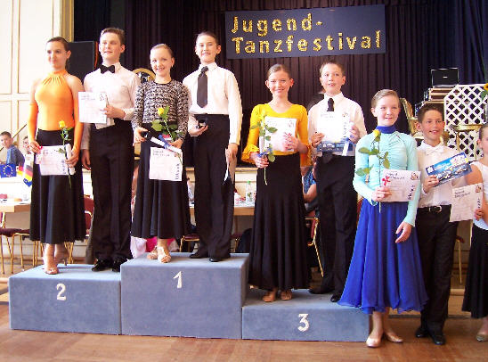

Katrin Goll und Marc Petersmann haben am Bad Liebenzeller Jugendtanzfestival im dortigen Kurhaus teilgenommen. Und das mit wirklich tollem Ergebnis.

In der Startklasse Junioren I C-Latein waren zehn Paare am Start. Die beiden erreichten sicher die Endrunde. Sehr enge Wertungen brachten ihnen hier den sechsten Platz ein.

Schon eine Stunde später gingen sie dann in ihrem ersten Standardturnier in der Startklasse Junioren I D auf das Parkett. Am Start waren hier elf Paare, was in dieser Altersklasse ein großes Starterfeld bedeutet. Auch hier konnten Katrin Goll und Marc Petersmann überzeugen und sich für die Endrunde qualifizieren. Das Paar zeigte wirklich gutes Tanzen und sicherten sich den dritten Platz.

Katrin Goll und Marc Petersmann waren total happy mit diesem Ergebnis bei ihrem ersten Standardturnier.

Christine Richter  
 14.07.2009

