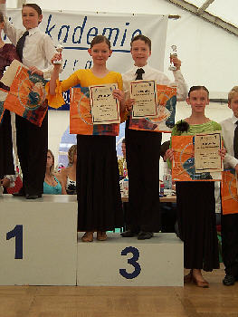

Katrin Goll und Marc Petersmann haben beim Ludwigsburger Open Air Turnier gleich zwei Turniere getanzt.

Zuerst war die Standardsektion an der Reihe. Hier tanzten die beiden in der Startklasse Junioren I D tanzten sie hier erst ihr zweites Turnier. Sicher erreichten sie die Endrunde und wurden ganz klar Dritte. Dafür wurden sie zusätzlich mit einem Pokal belohnt.

Eine gute Stunde später gingen Katrin Goll und Marc Petersmann dann in Junioren I C-Latein an den Start. Auch hier erreichten sie sicher die Endrunde und wurden wieder Dritte. Damit standen sie zum zweiten Mal auf dem Treppchen und holten sich den zweiten Pokal an diesem Tag.

Zum Aufstieg in B-Latein fehlen Katrin Goll und Marc Petersmann jetzt nur noch zwei Platzierungen, allerdings aber auch noch 37 Punkte.

Christine Richter  
 12.08.2009

