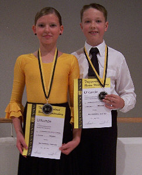

In Endersbach richtete der TSC Astoria Stuttgart die Landesmeisterschaft der Kinder, Junioren und Jugend in den Standardtänzen aus.

Katrin Goll und Marc Petersmann (beide 11 Jahre alt) hielten die Sindelfinger Fahnen in der Startklasse Junioren I D ganz hoch. Mit 20 von 21 möglichen Kreuzen erreichte die beiden die Endrunde. Hier zeigten sie von Anfang an, was sie gelernt hatten. Der schön getanzte langsame Walzer wurde von den Wertungsrichtern durchweg mit dem zweiten Platz belohnt. Der Tango war von den Wertungen etwas gemischter, brachte aber auch wieder den zweiten Platz. Im letzten Tanz, dem Quickstep gaben sie noch einmal richtig Gas und erhielten dafür die Note 1.

In der Gesamtwertung wurden Katrin Goll und Marc Petersmann bei ihrem dritten Standardturner bereits Vizemeister einer Landesmeisterschaft. Natürlich waren beide mit diesem Ergebnis rundum zufrieden.

Christine Richter  
 29.09.2009

