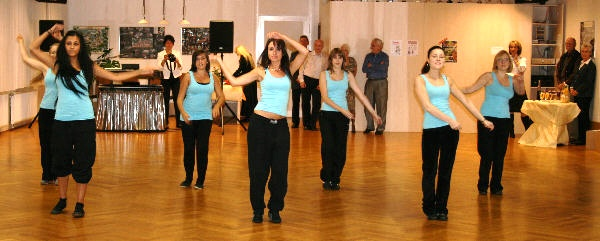

Die Mitglieder des TSC im VfL Sindelfingen trafen sich zum Herbstfest im Trainingszentrum. Hier gab es mal wieder Zeit, sich zu unterhalten und nicht nur immer zu trainieren.

Ein Rahmenprogramm, gestaltet von den Jazztänzerinnen und einem Discofox-Paar, und gute Tanzmusik, gespielt von Heidrun Dolde, sorgten für gute Stimmung.

Gutes Essen und Trinken sorgte für den Rest.

So verbrachten die Mitglieder einen fröhlichen Abend, der erst weit nach Mitternacht zu Ende war.

Christine Richter  
 10.11.2009

