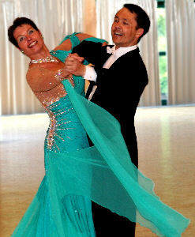

Rita und Thorsten Petersmann mussten in diesem Jahr für ihre Landesmeisterschaft in den äußersten Süden von Baden-Württemberg nach Freiburg fahren.

In der Startklasse Senioren I A-Standard war ein kleines aber feines Starterfeld vor Ort. Ganz sicher erreichten Rita und Thorsten Petersmann die Endrunde. Dort machte sich das intensive Training in den letzten Wochen bezahlt. Durchweg gute Wertungen brachte den beiden den dritten Platz und damit die Bronzemedaille ein.

Zufrieden mit der eigenen Leistung und überglücklich konnten Rita und Thorsten Petersmann die Heimfahrt antreten. Jetzt fehlen dem Paar nur noch drei erste bis dritte Plätze für den Aufstieg in die Sonderklasse.

Christine Richter  
 23.02.2010

