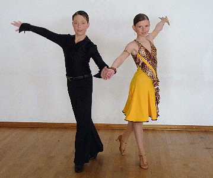

Mit einem Sieg haben Katrin Goll und Marc Petersmann den Aufstieg in die Junioren I B-Latein geschafft.

Beim Hohenloher Jugendmeeting in Öhringen waren in C-Latein 18 Paare aus mehreren Bundesländern am Start. Das war wirklich ein großes Feld. Schon in der Vorrunde zeigten die beiden, dass sie in die Endrunde wollten. Für ihre überzeugende Leistung wurden sie dann auch in der Vor- und der Zwischenrunde mit den besten Bewertungen belohnt.

In der Endrunde legten Katrin Goll und Marc Petersmann noch einmal ordentlich zu. Die Wertungsrichter waren sich zwar nicht ganz einig, wer am Ende ganz oben auf dem Treppchen stehen sollte. Aber das junge Paar wurde im Schnitt am besten bewertet und belegte damit den ersten Platz. Beide waren natürlich total happy, dass sie in ihrer Altersklasse jetzt die höchste Startklasse erreicht hatten.

Christine Richter  
 25.03.2010

