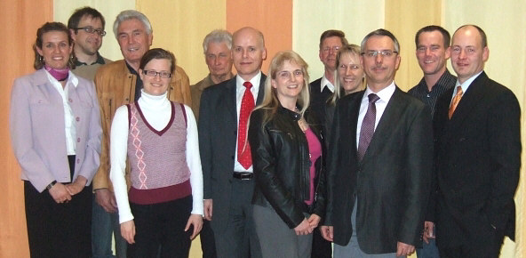
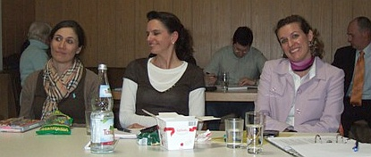
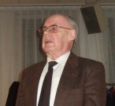
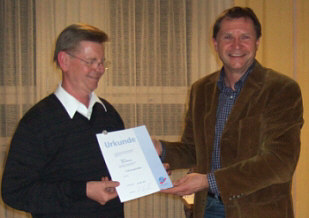

### 

Tanzsportclub im VfL Sindelfingen: Interimslösung beendet – der TSC Sindelfingen startet durch mit neuer Führung.

Mit Elan und dem Fokus auf Teamarbeit soll die Tanzsportabteilung von der Basis bis zum Turnierbereich neu aufgebaut werden, teilt Dr. Hanns-Georg Pipping in seiner Antrittsrede auf der Mitgliederversammlung 2010 mit. „Tanzen soll viel Freude machen, beim Tänzer und beim Betrachter.“

Für Bewegung will er nicht nur auf der Tanzfläche, sondern auch im Vereinsleben sorgen. Gemeinsam mit ihm engagieren sich das neu gewählte Vorstandsteam und 460 Vereinsmitglieder aus 30 Gruppen, so sollen die hervorragenden Möglichkeiten im TSC Sindelfingen noch besser genutzt werden.

„2009 war ein ereignisreiches Jahr für den Tanzsportclub im VfL Sindelfingen! Es war geprägt von unerwarteten Änderungen in der Abteilungsleitung, tollen Veranstaltungen, einer soliden finanziellen Basis, aber stagnierenden Mitgliederzahlen,“ informiert Klaus Richter im Rückblick über das Geschäftsjahr.

Der TSC bietet vom Jazz- über den Stepptanz, von den Gesellschafts- bis zu den Turniertanzgruppen in Standard und Latein über 30 Möglichkeiten tänzerische Ambitionen zu leben. 16 Trainer und Übungsleiter sorgen für Können und Spaß für Viele. Was sich im Tanzsportclub abspielt, stellten die einzelnen Gruppen vor.

  
 Die Jugendarbeit bildet weiterhin einen Schwerpunkt. In 19 Trainingsgruppen werden derzeit über 300 Kinder und Jugendliche betreut. Ein Blick auf die Warteliste zeigt, dass das Jugendleiter-Team: Sylvia Brückner-Lorenz, Claudia Bentele, Britta Sigmund und das Trainerteam hier gute Arbeit leisten. Neben den wöchentlichen Trainingsstunden fanden 2009 verschiedene Aktivitäten im Jugendbereich statt: in Jazztanz-Workshops und bei Auftritten gab es Gelegenheiten, das Gelernte zu zeigen. Ein Höhepunkt war die Jazztanzshow `Im TSC Erlebnispark' im Februar 2009 in der Stadthalle Sindelfingen. In einer rasanten Tanzshow begeisterten rund 300 Tänzerinnen und Tänzer an zwei Tagen über 2000 Zuschauer im ausverkauften Haus. Auftritte beim Sindelfinger Stadtfest und in der Fernsehsendung ’Tanzen mit Kaffee und Tee’ im SWR3 bereiteten Tänzern und Zuschauern Freude.

Zwar kann sich der Verein über steigende Zahlen in der Jazztanzabteilung freuen, muss aber Abgänge im Leistungsbereich verschmerzen. Sportwart Stefan Dietl bedauert die gesunkene Anzahl der aktiven Turnierpaare und will gemeinsam mit dem Vorstand neue Impulse für die Zukunft setzen. Der Verein kann mit Platzierungen bei Landesmeisterschaften, Aufstiegen in nächsthöhere Klassen und den Ergebnissen bei Turnieren mit den Paaren des TSC eine gute Bilanz vorweisen. Besonders erfreulich ist der Erfolg des jüngsten Paares Katrin Goll (12 Jahre)/Marc Petersmann (12 Jahre), die mit dem Aufstieg in Junioren I B-Latein die höchste Klasse bei den Junioren erreicht haben. Das Turniertraining wird von Spitzentrainern in der Standard- und Lateindisziplin geleitet. Mit Dagmar Beck ist es dem TSC gelungen, wieder eine Landestrainerin und Trainerin der Standard-WM-Formation für das Turniertraining im Standardbereich zu gewinnen. Das Latein-Training ist mit zwei A-Trainern, der mehrfachen 10-Tänze Weltmeisterin Anita Pocz und Rolandas Trembo, gut besetzt.

Für das Angebot Stepptanz im TSC wächst das Interesse und die neue Gruppe Discofox hat, ebenso wie der neue Einsteiger-Workshop, neue Paare zum Tanzen bewegt.

Das Team Klaus Arndt und Alfred Schmidt verwaltet 460 Mitglieder im Alter von unter 8 bis über 80 Jahren. Damit zählt die Tanzsportabteilung zu den mitgliederstärksten Abteilungen im Hauptverein und im Tanzsportverband Baden Württemberg.

Das Kassenteam, Claudia Lenz, Markus Feth und die Kassenprüfer, Herbert Schöllmann und Alfred Keicher zeigen sich zufrieden mit der soliden finanziellen Basis, die es erlaubt, das Vereinsheim zu erhalten und in die Zukunft zu investieren.

Nach der Entlastung der Abteilungsleitung durch den Vertreter des Hauptvereins, Harry Kibele, gab es Anlass für viel Engagement zu danken:   
  
  
 Ehrenvorsitzender Kühneweg ehrte Christine Richter, die seit 28 Jahren im Verein aktiv ist, seit 1994 in der Abteilungsleitung mitarbeitet, davon 4 Jahre als stellvertretende Clubleiterin.   
 Sie scheidet nach 16 Jahren aus dem Amt der Pressewartin, bleibt den Tänzern in ihrer Funktion als Übungsleiterin aber erhalten. Dank gab es auch für Claudia Bentele, die 4 Jahre stellvertretend als Jugendwartin mitwirkte und Alfred Schmidt, für 4 Jahre stellvertretende Mitgliederverwaltung. Der TSC ehrt Trudy und Manfred Bürger für 30 Jahre aktive Mitgliedschaft im Tanzsportclub Sindelfingen.   
 Eine besondere Ehrung erhielt Klaus Richter für hervorragende Verdienste um die Förderung des Sports, mit der Verdienstnadel in Silber des VfL Sindelfingen. Lobende Worte und Dank gingen an den Vorstand und die Geschäftsführung des VfL Sindelfingen für die gute Zusammenarbeit und die professionelle Unterstützung. Kooperation ist wichtig, wenn die neu zusammengesetzte Abteilungsleitung die abteilungsinternen und die externen Herausforderungen meistern will. Die Kassen der Kommunen sind leer und auch die Vereine der Stadt Sindelfingen werden sicherlich die Folgen zu spüren bekommen. Dank der clubeigenen Räume und der soliden finanziellen Basis ist die Tanzsportabteilung allerdings gut aufgestellt und kann sich den kommenden Aufgaben stellen.

Eines der wichtigsten Ziele für 2010 ist es, neue Konzepte zu erarbeiten und sie umzusetzen. Neue Impulse sollen in der Nachwuchsförderung, im Gesellschafts- und Turniertanzbereich gesetzt werden. Für diese Aufgaben und Ziele wurde ein neues Team gewählt: Clubleiter wurde Dr. Hanns-Georg Pipping, Stellvertreter Ingrid Bauer und Bernd Wolf. Das Sportwart-Team setzt sich aus Stefan Dietl, Frank Westerhoff und Rolf Zimmer zusammen. Die Kasse wird weiter von Claudia Lenz und Markus Feth betreut, Kassenprüfer bleiben Herbert Schöllmann und Alfred Keicher. Die Funktion des Schriftführers hat Klaus Richter übernommen. Für die Mitgliederverwaltung bleibt Klaus Arndt verantwortlich. Als Jugendwarte wurden Sylvia Brückner-Lorenz und Maren Reichel in der Jugendversammlung gewählt. Die Koordination von Veranstaltungen bleibt bei Ingrid Bauer. Die Öffentlichkeitsarbeit übernehmen Petra Mornhinweg und Dr. Anja Westerhoff sowie Bernd Peter als Webmaster. Um die Technik kümmern sich Stefan Dietl und um die Gebäude Rolf Zimmer. Mit vereinten Kräften will der Tanzsportclub im VfL Sindelfingen dafür sorgen, dass sowohl tanzbegeisterte Einsteiger, wie auch leistungsorientierte Tänzer in der neuen Struktur eine Heimat finden.

**Kurz notiert**

Neben zahlreichen vereinsinternen Aktivitäten wird es auch öffentliche Auftritte geben. Fest stehen die Termine für das Straßenfest in Sindelfingen am 19. und 20.06.2010 und am 5. Und 6. Februar 2011 die 10. Jazztanz-Show, das Motto bleibt streng gehütete Geheimsache! Schauen Sie mal rein: Angebote und Kontaktmöglichkeit unter www.tanzsportclub.vfl-sindelfingen.de

Petra Mornhinweg  
 03.04.2010

