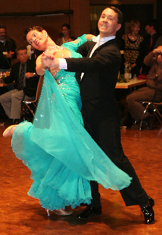

 Zwei mal drei ist in diesem Fall nicht einfach sechs, sondern fast die Erfüllung der sportlichen Träume von Rita und Thorsten Petersmann.

Nach den zwei dritten Plätzen am vergangenen Wochenende bei Turnieren in Ludwigsburg fehlt dem Tanzpaar vom TSC Sindelfingen nur noch eine 10. Platzierung (1.- 3. Platz) für den Aufstieg in die höchste Klasse.

Am Pfingstwochenende trat das Ehepaar aus Gäufelden zweimal bei dem 14. Pfingstpokalturnier des TSC Residenz Ludwigsburg in der Musikhalle in Ludwigsburg an, um sich der Konkurrenz zu stellen. Der Veranstalter verzeichnet mit über 400 Startmeldungen einen neuen Melderekord, mehr internationale Beteiligung und super Stimmung. An beiden Tagen war ein starkes Starterfeld aus Deutschland, Österreich und der Schweiz gemeldet. Das intensive Training der letzten Wochen hat sich gelohnt, denn unter den Augen der Clubtrainerin Dagmar Beck ertanzten sich Rita und Thorsten Petersmann am Sonntag einen hervorragenden dritten Platz von sechs Paaren.

Hochmotiviert vom Ergebnis des ersten Tages wollten wir am Montag wieder auf's Treppchen, freut sich Thorsten Petersmann. Denn angespornt durch diesen tollen Erfolg nahmen es die beiden am Montag mit 12 weiteren Paaren auf. Das Publikum unterstützte sie kräftig, und so sicherten sie sich nach drei Runden nochmals den dritten Platz.

Dieser wurde bei der Siegerehrung mit viel Applaus belohnt. Überglücklich verbuchte das Paar vom TSC Sindelfingen damit die achte und neunte Platzierung auf dem Weg in die S-Klasse.

Bei der Landesmeisterschaft im Oktober wollen wir auf jeden Fall in der S-Klasse tanzen. So steckten Rita und Thorsten das nächste Ziel einstimmig ab. Dafür fehlt noch eine Platzierung, die sie bis zur Landesmeisterschaft erreichen wollen. Der Tanzsportclub Sindelfingen freut sich mit seinem Turnierpaar auf das nächste Turnier, nach dem sicher von dem gewünschten Erfolg berichtet werden kann.

Presseteam  
 01.06.2010

