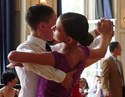
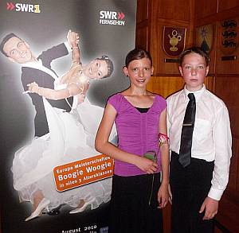

Junioren Standard und Latein– Katrin Goll und Marc Petersmann ertanzen Erfolge für den Tanzsportclub im VfL Sindelfingen.

Im Kurhaus Bad Liebenzell wurde Tanzsport der Spitzenklasse geboten. Angeknüpft an den letztjährigen Erfolg  mit weit mehr als 500 Besuchern fand auch in diesem Jahr das Bad Liebenzeller Jugend Tanzfestival statt. Über zwei Tage hinweg loteten die Teilnehmer der Turniere in den Standard und Lateinamerikanischen Tänzen die Besten unter sich aus. Bei Tango, Rumba, Cha-Cha-Cha und Co. wetteiferten Kinder und Jugendliche in sämtlichen Startklassen um hochkarätige Siegerpreise.

Auch Katrin Goll und Marc Petersmann ertanzten sich als Siegerpreis Feingoldbarren. So wurde die 16jährige Tradition der Pforzheimer Goldbarrenturniere fortgesetzt. Mehrere tausend Paare aus dem In- und Ausland nahmen bereits an der gemeinsamen Veranstaltung des Schwarz-Weiss-Club, dem Tanzsportzentrum Calw und dem Tanzsportclub Neuenbürg-Straubenhardt teil.

Umso mehr Anlass zur Freude für das 12 Jahre alte Jugendpaar aus Bondorf und Pforzheim, das für den TSC Sindelfingen antrat, über ihre tollen Erfolge: in Junioren I C Standard errangen sie einen 4. Platz, im Junioren I B Latein einen 6. Platz. Und im Junioren I D Standard beurteilten die sieben Wertungsrichter in einem Starterfeld mit sieben Paaren unser Paar in allen Tänzen mit 1-1-1.

Als zusätzliche Anerkennung erhielt die Tänzerin einen Schmuckanhänger in Schuhform und der Tänzer einen Gutschein für Tanzzubehör. Dieses super Ergebnis ist Motivation zu weiterem Training!

Presseteam  
 19.07.2010

