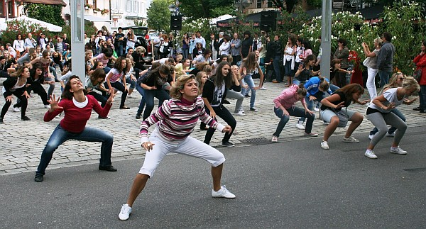
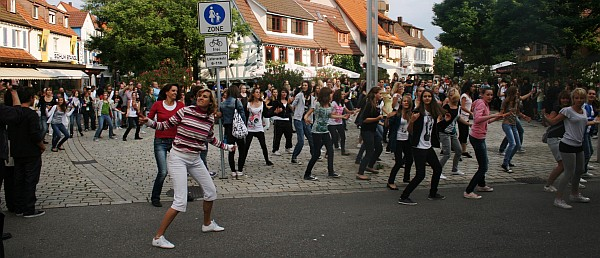

Was war denn da los?

Verwunderte Passanten wichen erschrocken den jungen Menschen aus, die, wie aus dem Nichts, auftauchten und die Straße, den Wettbachplatz an jenem Samstagabend für sich beanspruchten. Gerade eben noch hatte der Regen Sindelfingen in ein düsteres Sommerkleid gehüllt.

Gegen 19 Uhr wagten sich doch noch einige zaghafte Sonnenstrahlen hinter den Wolken hervor und staunten mit den Sindelfingern über die scheinbar wildgewordene Horde, die den Verkehr zum Erliegen brachte und für kurze Zeit das städtische Geschehen beherrschte. Doch schnell löste Begeisterung die Verwunderung im Publikum ab: aus dem scheinbar planlosen Auftauchen formierten sich Jazztänzer und brachten tänzerischen Energie zur Entfaltung. Geschäfte, Passanten, Restaurants der Sindelfinger Innenstadt wurden zur Kulisse für die Tänzerinnen des TSC im VfL Sindelfingen.

Flash Mob heißt die Lösung des rätselhaften Verhaltens. Einem Aufruf per SMS folgend trafen sich die Tänzerinnen der TSC-Jazzabteilung am Wettbachplatz, an dem sie weitere Instruktionen Ablauf des Flashmobs bekamen. Die für Flashmobs typische blitzartige Bildung: Mobs aus dem Nichts, das identische Handeln im Mob und die abrupte Auflösung nach wenigen Minuten gelang unter der Führung von Suzana Köster-Manojlovic, Maren Reichel, Syliva Brückner und Britta Sigmund hervorragend.

So schnell wie die Tänzer zusammengekommen waren, löste sich ihre Gruppe vor den Augen der verdutzten Zuschauer dann auch wieder auf. Es war zu sehen und zu spüren: viel Training steckte hinter dem kurzen Intermezzo.

Was da los war? Flash Mob – eine Überraschung für die Sindelfinger, lautet die Antwort.

pm  
 25.07.2010

