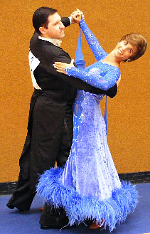

 Das erste Ziel für das erste gemeinsame Turnier – Tanz in die Endrunde. „Ziel erreicht!“ freuen sich Markus Frey und Ramona Lamnek vom TSC Sindelfingen. Lange bereitete sich das Tanzpaar für seinen Turnierstart vor. Auf den TüTaTa, den Tübinger Tanztagen 2010 in der Mössinger Steinlachhalle traten sie am Samstag in der Hauptgruppe II B Standard an.

Fikret Bilge, Vizepräsident des Veranstalters Tanzsportclub Astoria Tübingen e.V. lobte das in diesem Jahr besonders stark besetzte Feld in der Hauptgruppe II. Unter den 523 Teilnehmern waren Tanzpaare aus Deutschland, der Schweiz und dieses Jahr sehr zahlreich, aus Österreich angereist.

Sieben Paare traten in dieser Gruppe an, und das Paar vom TSC Sindelfingen erreichte mit einem technisch gut getanzten Turnier gleich ihre erste Endrunde und einen 6. Platz. Für den Wiener Walzer konnten sie sich einen 4. Platz sichern.

Am Sonntag ging es gleich nochmals an den Start in der Hkl II B Standard. Unter neun Starter-Paaren tanzten sie sich wiederum in die Endrunde und auf einen 6. Platz. Der TSC Sindelfingen freut sich mit seinen Neustartern über den schönen Erfolg.

Presseteam  
 26.07.2010

