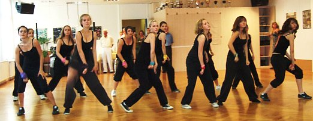
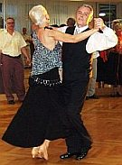
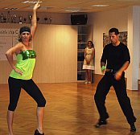
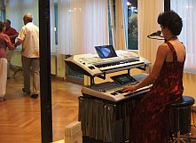
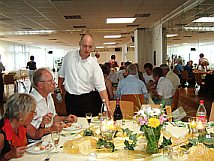
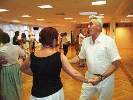
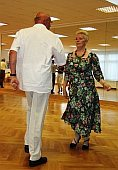

Unser Sommerfest 2010 war gut besucht und machte seinem Namen alle Ehre: tropische Temperaturen und tolle Vorführungen heizten die Stimmung im vollen Saal ein.

Unsere Jazz-Tanzgruppen brachten mit Ihrer gelungenen Vorführung eine geballte Ladung Energie auf das Parkett.

  
 Monika und Gerhard Winkler erfreuten das Publikum mit Ihrem großen Können und erheiterten mit einem tänzerischen Rezept für eine harmonische Partnerschaft.

  
 Sylvia Brückner und ihr neuer Tanzpartner Marius Pflüger zeigten phantasievolle Interpretationen aus Standard und Latein.

  
 Die musikalische Umrahmung von Frau Dolde war taktfest und verlieh den Tänzern dieses Jahr sehr viel Schwung!

  
 Das bestellte Essen und die vielen mitgebrachten Leckereien sorgten für Genuss und Kraft für die nächsten Tanzschritte. Die Versorgung mit Flüssigkeit war bei den Temperaturen äußerst wichtig. Viele fleißige Hände sorgten für die Vorbereitung und für das Aufräumen nach unserem schönen Sommerfest.

  

Allen Fleißigen voran, auch unseren Vortänzern: vielen Dank.

Presseteam  
 26.07.2010

