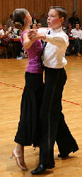
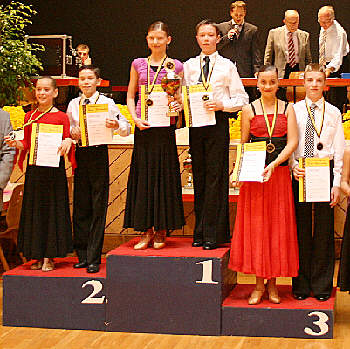

Katrin Goll und Marc Petersmann vom Tanzsportclub im VfL Sindelfingen. Nachdem die beiden Zwölfjährigen im Vorjahr Vizemeister waren, konnte sie in diesem Jahr bei den Landesmeisterschaften der Junioren I D-Standard kein anderes Paar stoppen: Mit 21 Einsen von allen Wertungsrichtern in allen Tänzen wurde das Jugendpaar des TSC im VfL Sindelfingen souverän Landesmeister 2010.

13 Paare ließen sie am Sonntag bei den vom ATC Blau-Gold Heilbronn veranstalteten Meisterschaften in Heilbronn-Sontheim damit hinter sich. Über die Vorrunde und die Zwischenrunde konnten sich die beiden Jugendlichen aus Bondorf und Pforzheim im Langsamen Walzer, Tango und Quick Step bis zur Endrunde steigern und wurden hierfür von allen Wertungsrichtern mit der Bestnote eins gesehen.

Als Lohn konnten sie glückstrahlend den Landesmeisterpokal entgegennehmen. Der Sieg bedeutete gleichzeitig den Aufstieg in die nächsthöhere Klasse Junioren I C-Standard, so dass Katrin und Marc diesen Wettbewerb ebenfalls mittanzten und dabei auch erstmals im Slow Fox antraten. Nach 17 Tänzen und 5 Tanzrunden schieden sie knapp vor der Endrunde mit einem geteilten 7./8. Platz aus. Tänzerisch konnten sie auch in dieser Klasse sehr gut mithalten.

Die Freude über den erzielten Erfolg bei den Landesmeisterschaften dürfte für Katrin Goll und Marc Petersmann noch mehr Ansporn für die Zukunft sein.

Presseteam  
 28.09.2010

