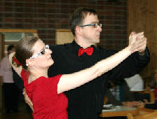
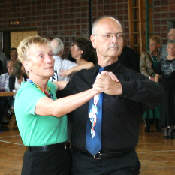

Beim Breitensportwettbewerb in Esslingen waren am Sonntag, den 26.09.2010 zwei Paare des TSC vertreten. Frank und Anja Westerhoff wagten sich zum ersten Mal bei einem solchen Wettbewerb aufs Parkett.

Unser zweites Paar, Bernd und Ingrid Peter, ging als Gegengewicht, mit viel Routine an den Start. Gemeinsam erreichten sie mit einem Pforzheimer Paar bei einer Teilnahme von 6 Mannschaften einen hervorragenden 2. Platz.

Zu den Siegern aus Esslingen fehlte unserer Mannschaft nur ein halber Punkt, zum 3. Platz waren allerdings fast 40 Punkte Unterschied. Auch die Einzelwertungen der beiden Paare können sich mehr als sehen lassen. Bei einer Teilnahme von insgesamt 20 Paaren landeten Bernd und Ingrid Peter auf dem tollen 4. Platz. Frank und Anja Westerhoff durften sich bei ihrem ersten Breitensportwettbewerb über einen 7. Platz freuen.

Das lässt für die Zukunft hoffen… Der nächste Breitensportwettbewerb mit Sindelfinger Beteiligung findet übrigens am 07.11.2010 ab 14h in Reutlingen statt. An diesem Tag wird der TSC sogar mit einer eigenen Mannschaft vertreten sein, da Stefan Dietl und Ingrid Bauer auch an den Start gehen werden. Wer Lust hat, unsere Mannschaft anzufeuern, ist sicher gerne gesehen.

Presseteam  
 7.10.2010

