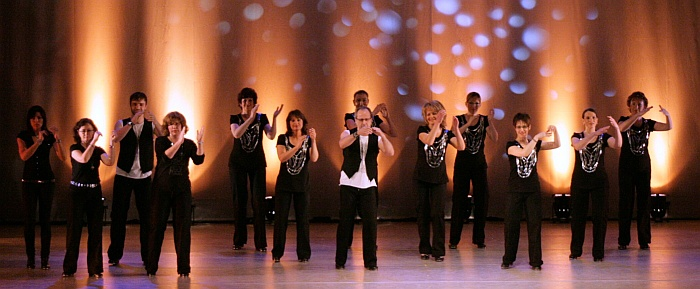
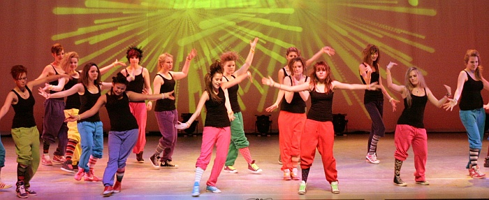
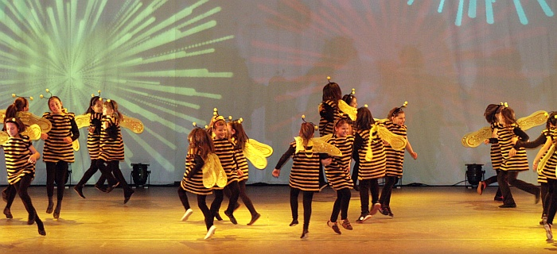
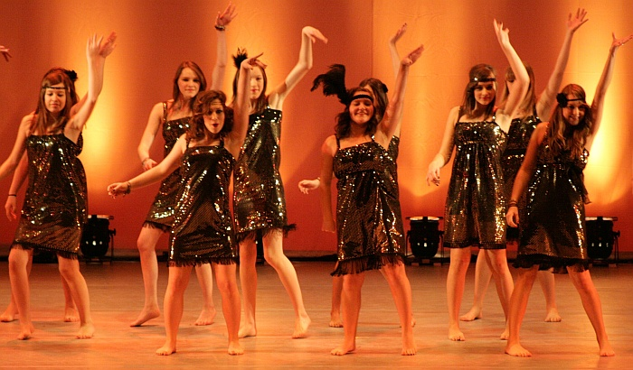
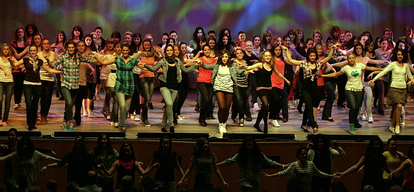
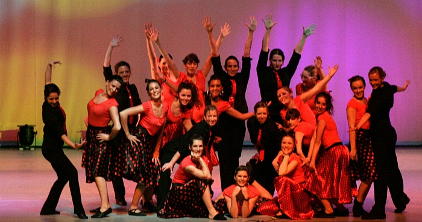
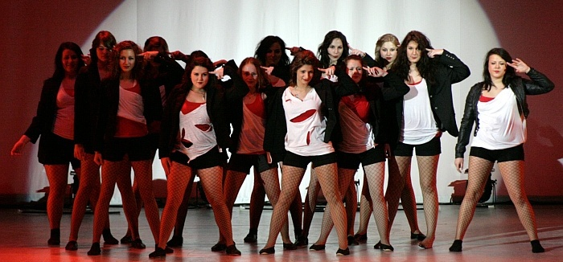

Jazztanzshow der Superlative - ein Feuerwerk an Licht, Farben, Ideen und Energie bündelten sich in einer grandiosen Jubiläumsshow.

Im Jubiläumsjahr des Tanzsportclubs im VfL Sindelfingen gab es am letzten Wochenende ein weiteres Jubiläum zu feiern: die 10. Jazztanzshow. Unter der Leitung von Britta Sigmund, Sylvia Brückner und Suzana Köster stellten mehr als 300 Tänzerinnen und Tänzer Ihr Können unter Beweis und sorgten bei jeweils 1000 Zuschauern für einen kurzweiligen Samstagabend und Sonntagnachmittag in der ausverkauften Sindelfinger Stadthalle. Unter dem Motto „Lustige Lach- und Sachgeschichten – Trainertreff“  wurden den Zuschauern die Herausforderungen des Trainerdaseins unterhaltsam nahe gebracht und die Schwierigkeiten, die solch eine Show-Planung mit sich bringt, witzig veranschaulicht.

Gelungene Choreographien zu bekannten Melodien des Pop und Rock, aber auch zu klassischer Musik, Stepptanz unter der Leitung von Marita Unsner und Kai Kresse bis hin zu aktuellem Hip Hop wurden in eine unterhaltsame Geschichte gepackt und tänzerisch spannend umgesetzt. Fantasievolle Kostüme rundeten das künstlerische Gesamtbild ab.

Während sich die kleinsten Jazztänzerinnen als Clowns und Biene Maja in die Herzen der Zuschauer tanzten, wurden von den Jugendlichen und Erwachsenen auf Songs von den Spice Girls, ABBA und Melodien aus Dirty Dancing und Hairspray einiges geboten. Mit einem Charleston wurde man, nicht zuletzt auch aufgrund der schönen, glitzernden Kostüme, in das goldene Zeitalter der 20er Jahre zurückversetzt. Afrikafeeling kam beim Programmpunkt „Afrika“ aufgrund der ausgewählten Musik, der bunten Kostüme und der Performance auf. Und auf die Musik von Queen wurde die Halle so richtiggehend gerockt. Einen Kontrapunkt hierzu setzte der Programmpunkt „Vier Jahreszeiten“, bei dem auf klassische Musik u.a. von Grieg  getanzt wurde und Drehungen sowie fließende Bewegungen dominierten. Weitere Programmpunkte waren Räuber Hotzenplotz, Santa Claus, Albtraum, Crazy und Ruby Blue. Den vielen Tänzerinnen und Tänzern konnte man den Spaß am Tanzen bei jeder Nummer des abwechslungsreichen Programms ansehen.

Ein tolles Erlebnis für die Zuschauer war die Wiederholung des Flash Mobs, der im Sommer auf dem Wettbachplatz die Sindelfinger Bürger begeisterte. 120 Tänzerinnen gaben auf und vor der Bühne u.a. auf Let’s Twist Again, YMCA und Thriller alles und hatten dabei eine unglaubliche Bühnenpräsenz.

Über ein Jahr Planung mündeten am Wochenende in ihren Höhepunkt im Schlusstanz zu „Music was my first love“ von John Miles. Mit einer tänzerischen Interpretation des anfänglichen ruhigeren Parts durch die Trainerinnen Claudia Junold, Maren Reichel, Elisa Porten Madeira, Olivia Possart, Nathalie Vallinot, Maike Leditzky, Suzana Köster, Sylvia Brückner und Britta Sigmund strömten schließlich alle beteiligten 18 Gruppen des TSC Sindelfingens zusammen, um sich gemeinsam in einem tänzerischen Feuerwerk der zweieinhalbstündigen Show vereint auf der Bühne zu präsentieren.

„Tanzen ist Träumen mit den Beinen.“, sagte Britta Sigmund am Ende der Show. „Das Training mit den kleinen und großen Tänzern macht uns unglaublich viel Freude.“ Die Show spiegelte die Begeisterung und das Engagement von allen Beteiligten in allen Farben und Facetten wider.

Die Arbeit der neun Jazztanztrainerinnen, der zwei Steptrainer und der vielen freiwilligen Helfer, die zum Gelingen der Show beigetragen und etliche Stunden ihrer Freizeit geopfert haben, hat sich in jeder Hinsicht gelohnt. Ohne dieses Zusammenwirken wäre eine solche Show nicht möglich gewesen. Ein besonderer Dank geht an Klaus und Christine Richter für die Technik und den Kartenverkauf.

Auf weitere Auftritte der Jazztanzgruppen des TSC dürfen sich Interessierte beim Internationalen Straßenfest in Sindelfingen am 18. und 19.06.2011 sowie beim Tag der offenen Tür des Tanzsportclubs am 23.10.2011 freuen.

tapdance

Crazy

Biene Maja

Charleston

Flash Mob

Hairspray

Ruby Blue

Presseteam  
 2011-02-13

