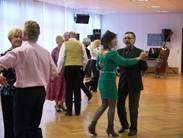
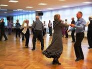

 Bereits im Februar konnte beim ersten Tanzcafé im TSC auf die Musik der Band Stubenjazz das Tanzbein geschwungen werden. Das Repertoire der Band bewegte sich von aktuellen Songs bis zurück in die 30er Jahre. Mit leckeren Kuchen, netten Tischgesprächen, einer Einführung in die Welt des Discofox und vielen Tanz-runden u.a. auf Evergreens von Frank Sinatra, Hildegard Knef und Duke Ellington konnte das erste Tanzcafé im TSC sich als gelungene Veranstaltung präsentieren. Neben Tanzpaaren des TSC konnten wir auch einige Gäste vom Nachbarclub TSC Rot-Weiß Böblingen begrüßen.

 Ganz herzlich laden wir Sie, und alle, die Tanzlust verspüren, zu unserem nächsten Tanzcafé ein. Dort können Sie zu Live-Musik der Tanzband Filder-Express tanzen, mit Gerhard und Monika Winkler einen Free-Style-Dance kennenlernen und einen geselligen Nachmittag bei Tanz und Kaffee verbringen. Das Tanzcafé findet am Sonntag, den 15. Mai von 14.30–17.30 Uhr in unserem Tanzzentrum in der Rudolf-Harbig-Str. 6 in Sindelfingen statt. Der Eintritt kostet 5 € und beinhaltet ein Glas Sekt zur Begrüßung.

Presseteam  
 29.04.2011

