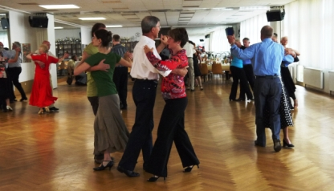
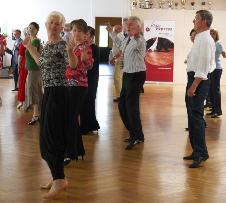
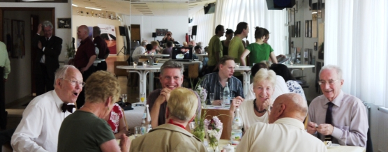

„Tolle Stimmung und volles Haus!“ freut sich der Erste Vorsitzende des Tanzsportclubs Sindelfingen Dr. Hanns-Georg Pipping. Trotz zahlreicher anderer Veranstaltungen am 15. Mai, die gleichzeitig in Sindelfingen stattfanden, verlockte das Tanzcafé im TSC mit dem „Filder Express“ am Sonntag Nachmittag zu Tanzfreuden und überzeugte.

Die Tanzkapelle Filder-Express ist bekannt für ihr musikalisch hohes Niveau sowie für die Breite des Repertoires und gilt in Fachkreisen als eine der besten deutschen Tanzkapellen auch in kleinerer Besetzung. Sie sorgte für beschwingte Tanzrunden mit perfekten Tanzrhythmen.

Das Tanzzentrum des TSC in Sindelfingen bietet auf rund 300 m² feinstem Tanzparkett eine hervorragende Gelegenheit Tanzlust mit vollem Schwung auszuleben. Im schönen Ambiente konnten die Besucher des zweiten Tanzcafés im TSC das Wochenende in geselliger Atmosphäre ausklingen lassen. Dafür sorgten auch der Sektempfang an Stehtischen zur Begrüßung und die Möglichkeit sich anschließend am leckeren Kuchenbuffet ausreichend für zahlreiche Tänze zu stärken.

Ein Mini-Workshop für einen Free-Style-Dance mit Monika und Gerhard Winkler sorgte für noch mehr Spaß auf dem Parkett. Zusätzliche Unterhaltung boten die digitale Bildergalerie mit über 3000 Bildern und die ausgelegten Fotoalben, die bildhaft die Geschichte von einem bewegten Vereinsleben und erfolgreichen Turnieren erzählten.

Auch mit der zweiten Jugenddisco wurde am Samstag Abend zum Tanzen, Quatschen und Spaß haben eingeladen. Sie fand dieses Mal vor allem Anklang bei den jüngeren Kids, die sich die „Super-Light-Show und die tolle Musik von DJ Nils Hitschke“ auch für die nächste Disco im TSC wünschten.

Zu großer Freude und belebter Geselligkeit führt auch, dass immer mehr externe Besucher kommen und die Angebote des Vereins Anklang finden. Besonders in seinem 40.Jubiläumsjahr will der Tanzsportclub das gebührend feiern und lädt zu verschiedenen Veranstaltungen ein. Am 23. Oktober stellen sich alle Tanzsparten am Tag der offenen Tür vor. Alle Freunde des Tanzens sind gleichzeitig zum dritten Tanzcafé im TSC und zu Live Musik eingeladen. Der Filder Express wird in großer Besetzung den musikalischen Rahmen zum Jubiläumsball am 5. November 2011 liefern und sicher mit dazu beitragen das Bürgerhaus in Maichingen an diesem Tag bis zum letzten Platz zu füllen.

Mit neuen Angeboten, wie Kurse für Einsteiger und Fortgeschrittene will der TSC mehr Tanzlustige von der Freude an der musikalischen Bewegung überzeugen. Seit dem 27.06.2011 können auch „Tanz-Singles“ Montag abends beim Line Dance mit durchstarten. Info unter: Tel. 07031 – 4 107 407 oder www.tanzsportclub.vfl-sindelfingen.de Der Tanzsportclub Sindelfingen freut sich auf Ihren Besuch!

