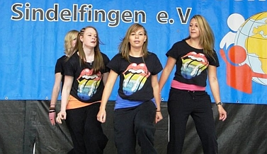

Tänzerisches Können des TSC Sindelfingen besteht gegen launenhaftes Wetter auf dem Internationalen Straßenfest in Sindelfingen und sorgt für großen Publikumsandrang.

Mit einer geballten Ladung jugendlicher Energie und großem tänzerischen Elan heizten die Jazztänzerinnen des TSC im VfL Sindelfingen den Besuchern des Internationalen Straßenfestes am Samstag und Sonntag ein. Das war auch notwendig, denn das launenhafte Aprilwetter an diesem Juniwochenende jagte mit kühlen 14 Grad den Besuchern die Kälteschauer über den Rücken.

Umso mehr erfreuten sich die Zuschauer vor den Bühnen an der Martinskirche, am unteren Marktplatz und auf dem Rathausvorplatz am Samstag und Sonntag an der tollen Stimmung auf den Bühnen, die auf das Publikum übersprang. Der Eifer und die Freude der jungen Tänzerinnen, gepaart mit gut trainiertem tänzerischem Können, brachte Sonne in die Herzen und ließ die Zuschauer das regnerische Wetter vergessen. Mit lautstarker Begeisterung und mit Applaus bedankte sich das Publikum für die tollen Vorführungen.

Der Tanzsportclub im VfL Sindelfingen freute sich auch in diesem Jahr wieder beim Straßenfest mitwirken zu können. An beiden Tagen traten 11 von insgesamt 17 Jazztanzgruppen aus unterschiedlichen Altersklassen auf. Mit großem Engagement brachten die Trainerinnen Sylvia Brückner, Elisa Porten Madeira, Maike Leditzky, Olivia Possart, Natalie Vallinot, Maren Reichel und Suzana Köster mit ihren Kinder-, Jugend-, und Erwachsenengruppen auch in diesem Jahr überzeugende Kostproben des Jazztanz im TSC auf die Bühne.

