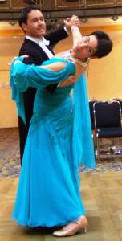
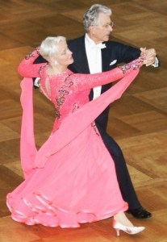

TSC-Turnierpaar Thorsten und Rita Petersmann tanzen strahlend in die zweite Runde Ihrer ersten GOC-S-Turnier-Teilnahme. TSC-Turnierpaar Henry und Regina Freude erleben ihre GOC Teilnahme erfolgreich aber mit gemischten  Gefühlen. Zwei Seiten der GOC eröffnen sich.

Nachdem Thorsten und Rita Petersmann im letzten Jahr in die höchste tänzerische Leistungsklasse aufgestiegen sind, haben sie bereits bei ihrer ersten GOC-Teilnahme in der Klasse Senioren II Standard in einem international besetzten und brillianten Starterfeld einen schönen Erfolg ertanzt. Sie belegten nach der zweiten Runde einen geteilten 143. Platz unter 251 teilnehmenden Paaren. Bereits bei dem Senioren I S Turnier auf der GOC 2011 belegten sie in diesem Jahr einen geteilten 170. Platz. Auf den ersten Platz bei diesem Turnier tanzten die Weltmeister der Senioren II S-Standard, Heinz-Josef und Aurelia Bickers und gewannen Gold für Deutschland. Die Besten aus über 50 Nationen waren hier mit am Start und die Zuschauer fieberten in der spannungsgeladenen Turnieratmosphäre mit.  
 Nachdem die erste Runde des Turniers Senioren II S Standard in der Alten Reithalle um 21.30 Uhr beendet war, begann der folgende Sonntag für das TSC-Turnierpaar Petersmann, das in Bondorf wohnt, bereits um 5.30 Uhr morgens. Aufwändige Vorbereitung und Anfahrt gehören neben dem ständigen Training stets dazu. Ein solcher Erfolg in dieser Klasse, unter diesem hochkarätigen Teilnehmerfeld, belohnt diese Mühen!

Die meisten Meldungen, die meisten Starts, die meisten Zuschauer. Die German Open Championships feierte ihr 25. Jubiläumsjahr und war für die Tanzsportler aus dem In- und Ausland tatsächlich der Nabel der Welt. Rund 4000 Zuschauer bevölkerten täglich den Beethovensaal, den Hegelsaal und die Alte Reithalle. Das Interesse der Presse und des Fernsehens war auch in diesem Jahr ungebrochen. Fünf Tage Tanzsport auf Weltklasseniveau liegen hinter den rund 5000 Teilnehmern. Die TSC-Paare hielten sich gut auf diesem meisterschaftlich betanzten Parkett.

Das TSC-Turnierpaar Henry und Regina Freude aus Ludwigsburg tanzt seit Jahrzehnten auf höchstem Niveau bei internationalen Turnieren mit. Seit vielen Jahren nehmen sie an der GOC in Stuttgart teil und tanzten sich auf einen geteilten 173. Platz. Viele Menschen läßt es freudiger in die eigene Zukunft blicken und bewundern, dass auch ältere Tanzpaare so aktiv und mutig sind, bei den German Open Championships an den Start zu gehen. Dieses Mal haben Henry und Regina Freude persönlich die Teilnahme an Ihrem Turnier in der Klasse Senioren S III Standard jedoch zwiespältig erlebt. Als Ludwigsburger freuten sie sich über den kurzen Anfahrtsweg und nahmen, wie in den letzten Jahren auch, an der GOC teil. In jedem Jahr kommen mehr Paare aus aller Welt nach Stuttgart. Dies hat in manchen Turnierrunden nicht nur positive Auswirkungen. In der Startklasse Senioren III A und S waren 208 Paare gemeldet. Es wurde in 13 Runden getanzt und die Wartezeit zwischen Langsamer Walzer, dem Tango und den folgenden Tänzen war sehr lang, ehe die Tanzpaare sich wieder - abgekühlt - aufs Parkett begeben konnten. Ewiges Herumstehen und wenig Kontakt mit anderen Tanzpaaren, waren das Ergebnis, finden Henry und Regina Freude. Sie freuen sich jedoch über ihre Erlebnisse am Rande des Turniergeschehens; über den mutigen französichen Tanzherrn, der, einen Kopf kleiner, Regina Freude anbietet mit ihr einen Valse viennois zu tanzen. In einer der Wartezeiten trafen sie auf ein Paar aus Finnland und lernten, dass Wiener Walzer auf finnisch Wiini valsi heißt. Sie erfuhren auch, dass dieses Paar das einzige seiner Altersklasse in Finnland ist! „Toll“, findet Regina Freude, „dort sollten wir mal starten, da wären wir garantiert auf dem 2. Platz! oder fahren wir lieber doch nicht nach Finnland? Denn, im Grunde wären wir da ja doch nur Letzter! - Logisch, oder?“

Presseteam  
 24.08.2011

