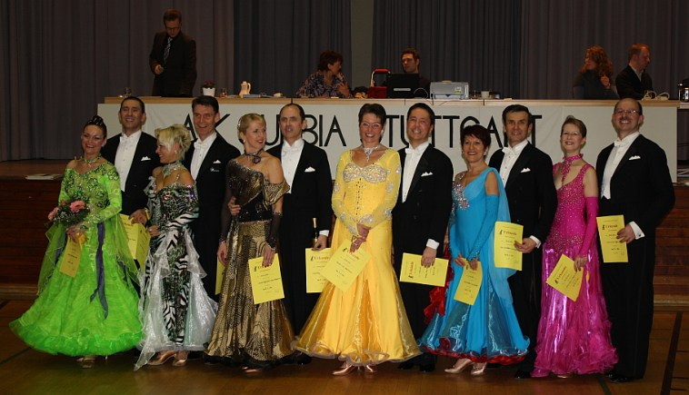

Da sie  in den letzten Wochen nicht intensiv trainieren konnten waren Thorsten und Rita Petersmann  
mit nicht so grossen Erwartungen zum Turnier nach Stuttgart gefahren.   
  
Ohne großen Erfolgssdruck tanzten sie locker die Vorrunde im Startfeld der 12 Paare der Senioren II S Klasse.  
Diese Lockerheit zahlte sich aus, denn Petersmanns waren völlig überrascht als sie für die Endrunde der besten 6 Paare aufgerufen wurden. Glücklich über diesen Erfolg konnten sie sich dann von Tanz zu Tanz nochmals steigern und verpassten mit einem 4. Platz nur knapp den Schritt aufs Treppchen.  
  
Dieser Überraschungserfolg im ersten Jahr in der S-Klasse freute sie besonders, da es ihnen an diesem Tag gelungen war auch Paare hinter sich zu lassen, die schon seit Jahren in dieser Klasse tanzen.

05.02.2012

