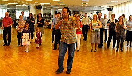
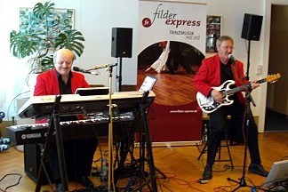

Der TSC im VfL Sindelfingen hatte am 25.03.2012 zum ersten Tanzcafe des Jahres 2012 eingeladen. Trotz des schönen Wetters und der frühlingshaften Temperaturen fanden viele Mitglieder und Gäste den Weg ins Trainingszentrum des TSC.

Der Filder-Express trug mit seiner tollen Tanzmusik zur guten Stimmung bei und die Tanzfläche war immer gut besucht. Mit einer kurzen Einführung in die Geheimnisse der Salsa sorgte unser Salsa-Trainer Dominique für zusätzliche Unterhaltung.

Das nächste Tanzcafe des Tanzsportclubs findet im Rahmen der Feierlichkeiten zum 150 jährigen Jubiläum des VfL Sindelfingen am Familiensportsonntag, 15.07.2012 statt. Schauen Sie dann doch mal bei.

