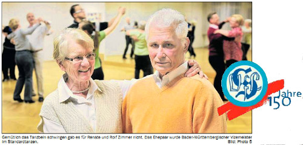

[ - © SZ/BZ-Online (www.szbz.de) ](http://epaper.szbz.de/edition-rsi/data/20120421/01/SZ/page.jsp)

Presse | Tanzen | 21.04.2012

 Quelle: SZ/BZ-Online (www.szbz.de)

_Von unserem Redaktionsmitglied Daniel Krauter_

**Wenn der ehemalige Weltklasse-Diskuswerfer Lars Riedel bei der RTL-Show „Let´s Dance" mit seiner Tanzpartnerin mehr schlecht als recht übers Parkett fegt, dann kann sich Rolf Zimmer ein Schmunzeln nicht verkneifen: „Mit Tanzen im eigentlichen Sinne hat die Show nicht viel zu tun. Dennoch ist es kostenloses Marketing für uns Tanzsport-Abteilungen, da die Sendung auch jüngere Zielgruppen anspricht."**

Dabei kann sich der Tanzsportclub (TSC) Sindelfingen nicht gerade über Nachwuchssorgen beklagen. „Der Jazztanz hat einen enormen Zulauf. Diese Sparte ins Leben zu rufen, war Gold wert", sagt Klaus Richter, ehemaliger Abteilungsleiter und jetziger Schriftführer. Mehr als die Hälfte der Mitglieder des TSC sind mittlerweile in dieser seit 1996 bestehenden Sparte organisiert. Im Jubiläumsjahr 2011 - der TSC Sindelfingen feiert sein 40-jähriges Bestehen - zeigten die Kinder und Jugendlichen bei der zehnten Jazztanzshow einmal mehr ihr Können.

Als Rolf Zimmer gemeinsam mit seiner Frau Renate im Jahre 1975 der Abteilung beitritt, verschwendet der VfL Sindelfingen noch keinen Gedanken an Jazztanzen.

„Wir haben schon in unserer einstigen Heimat Berlin zusammen getanzt. Es ist einfach ein toller Sport, den man gemeinsam mit seiner Frau betreiben kann. Wir haben mit dem Tanzen schnell Kontakte geknüpft und fühlten uns in Sindelfingen sofort rundum wohl. Dies hat sich bis heute nicht geändert", blickt Rolf Zimmer auf seine Anfänge beim Tanzsportclub im VfL Sindelfingen zurück.

Gemütlich das Tanzbein zu schwingen, damit ist es für die Zimmers nicht getan. Es stellen sich schnell die ersten Erfolge ein. So tanzt sich das Ehepaar Zimmer bis in die A-Klasse vor und nimmt erfolgreich an vielen Turnieren teil. Als Turniertänzer im Standard werden Renate und Rolf Zimmer Baden-Württembergische Vizemeister. „Das war schon eine tolle Zeit damals. Wir waren vom VfL fünf bis sieben Paare, die durch ganz Süddeutschland gereist sind. Wir Sindelfinger Tänzer haben uns immer sehr gut verstanden. Es wurde schon etwas spöttisch von der Mafia aus Sindelfingen gesprochen, wenn wir in der großen Gruppe unterwegs waren." Tägliches Training steht damals für das sportliche Ehepaar Zimmer auf der Tagesordnung. „Ich habe alle Tanzstile gerne getanzt. Egal ob Rumba, Tango oder Walzer", sagt Rolf Zimmer.

Nach einem Skiunfall muss Rolf Zimmer mit dem Turniertanzen aufhören. Ganz kann er es aber nicht lassen, und so wird der Holzgerlinger im Jahre 1988 an der Seite seiner Ehefrau Breitensport-Übungsleiter. Dieses Amt übt der heute 74-Jährige bis 2002 aus. Zudem ist er über 22 Jahre lang Sportwart der Sindelfinger Tänzer. „Es hat mir immer große Freude bereitet, meine Erfahrungen an die Tanzpaare weiterzugeben", blickt Rolf Zimmer gerne zurück.

Seit Mitte der siebziger Jahre blüht die Tanzsportabteilung innerhalb des VfL Sindelfingen so richtig auf. 1976 findet das erste von bis heute über 70 Sindelfinger Amateurtanzturnieren statt. 1983 richtet der TSC Sindelfingen die deutsche Lateinmeisterschaft in der Sindelfinger Stadthalle aus. Es entwickelt sich ein blühendes Clubleben mit vielen Veranstaltungen wie Maiwanderung, Candle-Light-Party, Sommerparty, Herbstwanderung, Kleiner Herbstball, Nostalgie- Party und Winterball. Und wie es die Art von Rolf Zimmer ist, packt er immer kräftig mit an, wenn es etwas zu tun gibt. So auch im Jahre 1987, als der Traum von Rolf Zimmer und Eckhard Läufer wahr wird.

Mit der Unterstützung von Karl-Heinz Reinheimer bezieht der TSC im Atriumgebäude neben der Geschäftsstelle des VfL Sindelfingen seine eigenen Räume. „Durch die Arbeit von Rolf und vielen anderen wurden den Turnierpaaren durch das Tanzsportzentrum optimale Trainingsmöglichkeiten geboten. Das hat der ganzen Abteilung einen deutlichen Schub nach vorne gegeben", sagt Klaus Richter.

Anlässlich des 20-jährigen Jubiläums steigt 1991 in der Sindelfinger Stadthalle die deutsche Meisterschaft S1. Die Räume für die Tänzer werden in der Daimlerstadt schnell zu klein, und so fällt die Erweiterung des Tanzsportzentrums im Jahre 2005 unter die Regie von Rolf Zimmer. Unter seiner Verantwortung entsteht in über 2000 Arbeitsstunden ein Schmuckstück, das bei einer Einweihungsparty glanzvoll gefeiert wird.

Für seine Verdienste um die Abteilung erhält Rolf Zimmer vom VfL die Ehrennadeln in Bronze, Silber und Gold. Die Stadt Sindelfingen zeichnet ihn mit der Sportlerplakette aus. Als stellvertretender Sportwart und dienstältestes Vorstandsmitglied prägt Rolf Zimmer auch heutzutage noch das Geschehen um den TSC Sindelfingen mit. „Seine Meinung ist auch bei den jüngeren Mitgliedern immer gefragt und man bekommt viele hilfreiche Tipps", sagt Klaus Richter. „Ich wollte dem Tanzen nur etwas davon zurückgeben, was er mir über die beinahe 40 Jahre gegeben hat", so ein bescheidener Rolf Zimmer.

