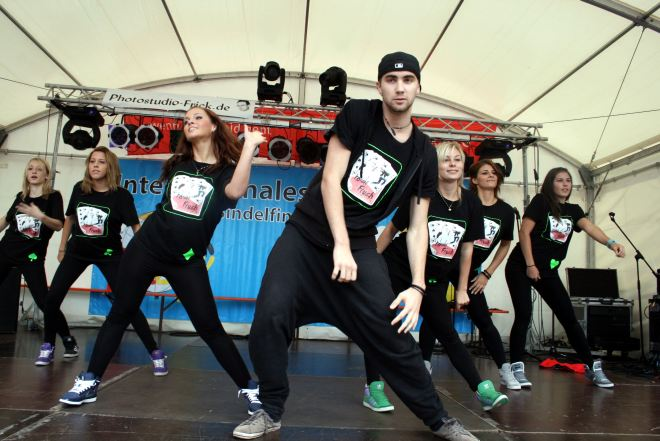

### 

Die Jazztänzer des TSC im VfL Sindelfingen sind jetzt schon seit Jahren ein fester Bestandteil des Sindelfinger Straßenfests. Mit mehr als 150 Tänzerinnen und Tänzern der Sparte Jazzdance-Style war der Tanzsportclub auch dieses Jahr an zwei Tagen dabei.

Außerdem zeigte die erst seit einigen Monaten bestehende Kindertanz-Gruppe ihr Können. Die drei- bis sechsjährigen Kinder begeisterten mit ihrem Auftritt ‘Hot Banditoz-Veo Veo‘ die Zuschauer.

Natürlich zogen auch die 17 Jazzdance-Style Gruppen - nicht nur auf Grund der fetzigen Musik - viele Zuschauer an. Gekonnt und ausdrucksstark wie immer brachten die Kinder-, Jugend-, Erwachsenengruppen ihre Tänze auf die Bühne.

[Bilder vom Strassenfest](internationales-strassenfest-2012.html)

