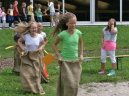
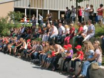
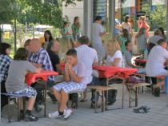
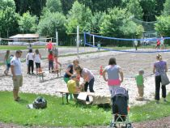

**Strahlender Sonnenschein am Kindersommerfest im Juli 2012**

Am 8. Juli 2012 fand das Kindersommerfest für die zahlreichen Mädchen und Jungen des Tanzsportclubs statt. Mit strahlendem Sonnenschein und vielen Spielstationen auf den Volleyballfeldern und rund ums Vereinsheim, konnten die Kinder Sackhüpfen, Limbo tanzen, Teebeutel weitkicken, auf Stelzen laufen und vieles mehr. Auch für Verpflegung war gesorgt. Dank der zahlreichen Kuchenspenden waren alle gut versorgt. Höhepunkt waren die tänzerischen Einlagen von allen Kindergruppen mit einem tosenden Applaus. Danke an alle Helferinnen und alle Beteiligten für diesen gelungenen Nachmittag mit Spiel, Spaß und guter Laune!

