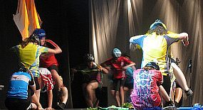
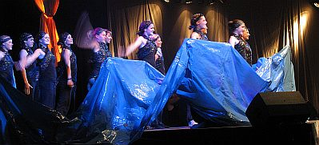

### 

100 Tänzerinnen der Jazzdance-Style-Gruppen gehörten zum Rahmenprogramm des Festakts "150 Jahre VfL Sindelfingen" am 12. Juli 2012. Mit zwei Auftritten begeisterten sie die 600 geladenen Gäste. Der erste Auftritt "Past to now" lockerte zu einem Medley aus Melodien mit Ohrwurmcharakter die Stimmung erst einmal auf.

Aber die Trainerinnen hatten sich anlässlich der Veranstaltung noch etwas ganz Besonderes ausgedacht. Unter dem Motto "Es lebe der Sport" tanzten sie zur jeweils passenden Musik unter anderem die Sportarten Boxen, Schwimmen, Radfahren, Basketball, Fußball und Leichtathletik. Die von den einzelnen Abteilungen ausgeliehenen Trikots verstärkten den Eindruck noch. Am Ende dieses Auftritts gab es rauschenden Beifall für die Tänzerinnen.

