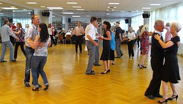

Am 15.07.2012 gingen die Jubiläumsfeierlichkeiten „150 Jahre VfL Sindelfingen“ mit dem Familien-Sport-Sonntag nach vier Tagen zu Ende. Im Rahmen dieser Festlichkeiten veranstaltete der TSC im VfL Sindelfingen sein Tanzcafé.

Auch dieses Mal war es wieder gut besucht. Es kamen nicht nur die Tänzerinnen und Tänzer aus dem eigenen Verein, sondern auch Gäste aus anderen Tanzclubs konnten begrüßt werden. Außerdem fanden auch viele Besucher der übrigen Events des Familien-Sport-Sonntags den Weg in die Räumlichkeiten des TSC.

Wie immer sorgte die Band Filder-Express mit guter Tanzmusik für die richtige Stimmung und für viel Betrieb auf der Tanzfläche. Abgerundet wurde der gelungene Tanznachmittag mit Kaffee, hausgemachtem Kuchen, kalten Getränken und Auftritten der Kinder der Jazzdance-Style-Gruppen.

