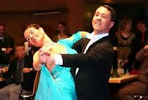

Die 26. German Open Championships (GOC) sind vorbei. Fünf Tage lang war das Kultur- und Kongresszentrum Liederhalle in Stuttgart das Mekka des Tanzsports. Gut 2.500 Paare aus 56 Nationen kamen und gingen bei 36 Einzelturnieren an den Start. Vom TSC im VfL Sindelfingen waren Rita und Thorsten Petersmann beim Weltranglistenturnier der Senioren II S mit dabei.

„An der GOC teilzunehmen ist ein ganz tolles Erlebnis und eine große sportliche Herausforderung“, sagten die beiden. Ihr Turnier, bei dem insgesamt 206 Paare aus 21 Nationen am Start waren, begann am Freitagabend. Rita und Thorsten Petersmann brachten eine gute Leistung auf das Parkett und qualifizierten sich ganz klar für die zweite Runde. Dafür mussten die beiden früh aufstehen, denn es ging am Samstag bereits um 8:45 Uhr wieder los. Hier zeigten immer noch 150 ihr Können. Die Leistungsdichte in diesem Starterfeld war sehr hoch. Das stellte nicht nur die Paar, sondern auch die Wertungsrichter aus 11 Nationen vor eine schwierige Aufgabe.

Rita und Thorsten Petersmann tanzten locker, schwungvoll und technisch sauber. Sie konnten mit dieser guten Leistung noch einige ihrer Konkurrenten hinter sich lassen. Leider verpassten sie ganz knapp den Einzug in die dritte Runde, für die sich noch 100 Paare qualifizierten. Dennoch waren Rita und Thorsten Petersmann mit ihrem Abschneiden sehr zufrieden. Ihr Kommentar: „Bei einem so hochrangigen, internationalen Turnier einen Platz im Mittelfeld zu belegen, ist für uns schon ein Erfolg.“ Die gute Vorbereitung hatte sich gelohnt, denn sie konnten sich im Vergleich zum letzten Jahr deutlich weiter vorn platzieren.

