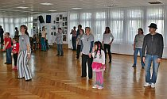
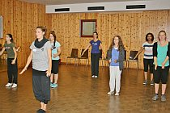
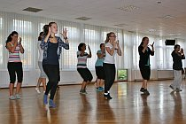
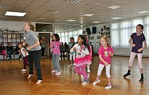

Guten Zuspruch fand der Schnuppertag am 23.09.12 in den Räume des Tanzsportclubs. Obwohl das sonnige Wetter zu Aktivitäten im Freien einlud, waren die kostenlosen Workshops in den Trainingsräumen gut besucht. Nachdem die Workshops beendet waren, zeigten einige Gruppen des Tanzsportclubs ihr Können. Beim Steptanz wurden sogar die Teilnehmer des Workshops in den Auftritt integriert.

Die ausgelegten Interessenenlisten waren gut gefüllt, so dass mindestens eine neue Jazzdance-Style Gruppen entsteht und einige Tänzerinnen in bestehende Gruppen aufgenommen werden können. Auch für Kurse, Tanzkreise und Steptanz bestand reges Interesse.

