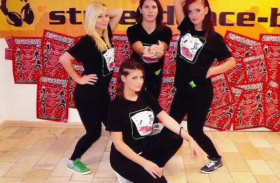

Die Stuttgarter Jugendhaus Gesellschaft veranstaltet jedes Jahr einen Street – Dance – Contest für Mädchen und junge Frauen. Dieser Contest bietet sowohl Nachwuchs als auch erfahrenen Tänzerinnen die Möglichkeit, sich zu präsentieren. Am 26.10.2012 gingen insgesamt 14 Gruppen an den Start.

Mit dabei war auch die Contest-Gruppe des Tanzsportclubs im VfL Sindelfingen. 

  
Für die erst im Januar 2012 gegründete Contest-Gruppe war es der erste Auftritt bei einem Wettbewerb. Die Choreographie setzte sich Elementen des Hip Hop und Video Clip Dancing  zusammen und dauerte vier Minuten. Die Mädels des TSC zeigten der Jury, was sie tänzerisch drauf hatten.

Und das mit Erfolg ! Am Ende konnte sich das junge Team in einem wirklich starken Feld über einen fünften Platz freuen.  Durch diesen  Motivationsschub beflügelt, werden die Tänzerinnen jetzt weiter arbeiten und fleißig trainieren, um beim nächsten Contest im Dezember ihre tolle Leistung zu bestätigen oder sogar noch zu verbessern.

