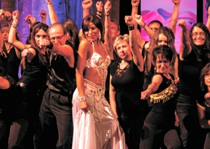

Bereits am 15. Dezember 2012 fand die Benefizveranstaltung „kreativ statt aggressiv“ des TSC im VfL Sindelfingen und des Vereins Kunst und Kultur in LA(ichingen) zugunsten der Bürgerstiftungen Sindelfingen und Laichingen statt. Die Steptrainer des TSC und Gründer des Laichinger Vereins, Marita Unsner und Kai Kresse, waren die Initiatoren dieser Veranstaltung. Sie hatten die Idee, durch diese Veranstaltung das Engagement der beiden Bürgerstiftungen bei der Problematik der Vorbeugung gegen Gewalt zu unterstützen. 

Unterstützung erhielt die Veranstaltung durch Sponsoren: der Kreissparkasse Böblingen, dem Marriott Hotel Sindelfingen, dem Sportamt Sindelfingen, der Sindelfinger Zeitung und den Volksbanken Böblingen und Laichingen. Die Vorstände des TSC im VfL Sindelfingen und Kunst und Kultur Laichingen waren als Veranstalter verantwortlich. Am Nachmittag wurden verschiedene Workshops angeboten. Sie umfassten die Bereiche Tanz, Musik und Malerei. Bei der abendlichen Galaveranstaltung gesellten sich zu den Steppern, Tänzern und Sängern aus Laichingen, eine orientalische Tänzerin und vom TSC die Stepper und Jazz-Tänzerinnen und das Standardpaar Rita und Thorsten Petersmann. Eine reichbestückte Tombola wurde unter anderem von Pur, Fools Garden, dem Tänzer Richard Labrousse, den Malern des Workshops und Henry Maske, mit handsignierten Boxhandschuhen, gesponsert. 

Am Ende der Veranstaltung konnte den beiden Bürgerstiftungen jeweils ein Scheck in Höhe von 1.000 Euro überreicht werden. Das Geld wird für weitere Projekte unter dem Motto „kreativ statt aggressiv“ Verwendung finden. Dank gilt besonders Marita Unsner und Kai Kresse, den Akteuren auf der Bühne und den vielen helfenden Händen, ohne die diese Veranstaltung nicht möglich gewesen wäre. 

