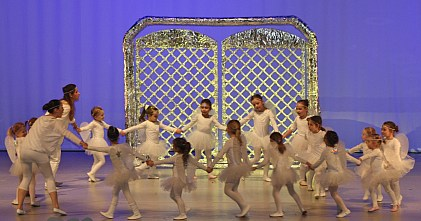

„Im Himmel ist die Hölle los“, so lautete das Motto der diesjährigen Tanzshow des TSC im VfL Sindelfingen. Am 2. Und 3. Februar kamen rund 1.800 Großeltern, Eltern, Tanten und Onkel, Geschwister und Freunde der gut 300 Mitwirkenden in die Stadthalle Sindelfingen.

Sie alle wollten sehen, was die ganz, ganz jungen und die schon sehr erfahrenen Tänzerinnen in den letzten Wochen und Monaten einstudiert hatten. Die Trainerinnen hatten in Zusammenarbeit mit ihren Tänzerinnen und Tänzern sowohl bei der Auswahl der Musik als auch bei den Choreographien wieder ein gutes Händchen gehabt.

Den Anfang machten die jüngsten Tänzerinnen, die als kleine Engel über die Bühne schwebten. Sie und Petrus hielten über die gesamte Show den „roten Faden“ in den Händen. Im Verlauf der Show kamen sowohl Pop-Ikonen, Figuren aus der Weltgeschichte, Größen der klassischen Musik und andere große Künstler zu Ehren. Whitney Houston, Elvis Presley , James Brown und Marvin Gaye spielten genauso eine Rolle wie Beethoven, Frank Sinatra und Falco. Zusammen mit den ‘‘Opis‘‘ (Klaus Arndt und Manfred Röckle) wurde ein Besuch in der Malschule von Picasso und im Museum gemacht. Viele kleine Super Marios brachten das große, gefährliche Monster zur Strecke. Robin Hood, Charlie Chaplin, Panzerknacker in Miami, Astrid Lindgren und Pippi Langstrumpf hatten ebenso ihren Auftritt. Mr. Sandman brachte süße Träume und Petrus (Siegfried Barth) war für das Wetter zuständig. Außerdem schickte er einige finstere Gestalten in die Hölle, da für sie im Himmel natürlich kein Platz war. In der Hölle sorgte eine Peitsche schwingende Teufelin dafür, dass die Arbeit erledigt wurde und dass das Höllenfeuer weiter lodernd brannte.

Die Tänzerinnen zeigten auch ihre Verbundenheit zu anderen Abteilungen des VfL Sindelfingen. Wie schon bei der Jubiläumsveranstaltung zum 150. Geburtstag des VfL zeigten sie, dass man Sportarten wie z.B. Fußball, Boxen, Radfahren und Schwimmen auch tänzerisch darstellen kann. Wie alle anderen Programmpunkte wurde auch dieser mit viel Beifall belohnt.

All diese Themen wurden von drei bis 40-jährigen Mitwirkenden mit viel Spaß, außergewöhnlichem Können und großer Präzision tänzerisch dargestellt. Kurz vor Ende der Show kam es im Himmelscafé zu einem Stromausfall. Bis Herr Edison eine Glühbirne ersetzt hatte, kamen auf der dunklen Bühne bunte Lampen, Glühlampenröckchen und Schwarzlicht zum Einsatz. Danach kamen noch einmal alle Mitwirkenden und die Trainerinnen zur Himmelsversammlung und damit zum Schlusstanz auf die Bühne.

Wie immer war es ein grandioser Anblick all die vielen kleinen und großen Tänzerinnen und Tänzer auf der Bühne versammelt zu sehen. Nach fast 3 Stunden und 20 Programmpunkten ging an beiden Tagen eine großartige und erfolgreiche Show zu Ende. Den Trainerinnen Britta Sigmund, Elisa Porten Madeira, Maike Leditzky, Maren Reichel, Natalie Vallinot, Olivia Possart, Sabine Visi, Alexandra Berner und Suzana Köster-Manojlovic ist ein großes Lob auszusprechen. Dank gilt natürlich allen Helfern bei Bühnenbild, Animation, Beleuchtung, Ton und den Backstage-Helferinnen, die dafür sorgten, dass alle Tänzer/innen zur rechten Zeit am rechten Ort waren. Die vielen leckeren, von den Familien der Mitwirkenden gespendeten, Kuchen kamen in der Pause gerade recht, um sich für den zweiten Teil der Show zu stärken. Ohne die Unterstützung der vielen Helfer und unserer Sponsoren Kreissparkasse Böblingen, Marriott Hotel Sindelfingen, Congress Center Böblingen / Sindelfingen und dem Filmzentrum Bären könnte eine derartige Veranstaltung nicht stattfinden.

[Bilder zur Aufführung](im-himmel-ist-die-hoelle-los.html)

Auf youtube sind Videos von der show zu finden

Jazztanz Show 2013 "Impressionen" (created by Maike Led) 

Teaser - Jazztanzshow 2013 

[Backstage Interview - Maxime & Sam (Rohfassung inkl. Gangnam Style) ](http://www.youtube.com/watch?v=iGXsg-THqtM)

