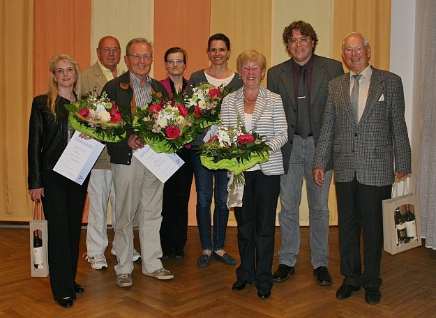

  
Die geehrten Mitglieder von links nach rechts: Ingrid Bauer, Manfred Röckle, Friedemann Frasch, Abteilungsleiterin Dr. Anja Westerhoff, Britta Sigmund, Rosmarie Kessel, VfL Geschäftsführer Roland Medinger, Horst Kessel.

Am 26. April trafen sich die Mitglieder der TSC im VfL Sindelfingen zur Jugend- und anschließend zur Mitgliederversammlung. Wie immer fanden beide Versammlungen in gutem Einvernehmen statt. Abteilungsleiterin Ingrid Bauer begrüßte die Anwesenden und den VfL-Geschäftsführer Roland Medinger. Anschließend berichteten die Vorstandsmitglieder über das vergangene Jahr. Die Berichte zeigten, dass der TSC gut aufgestellt ist. Konstante Mitgliederzahlen,  tolle Veranstaltungen und eine solide finanzielle Grundlage waren die Bilanz des Jahres 2012. Die Kassenprüfer, bescheinigten eine ordnungsgemäße Kassenführung. Alle Vorstandsmitglieder wurden einstimmig entlastet.

Roland Medinger begrüßte die Anwesenden und bedankte sich bei der ganzen Abteilung für die gute Arbeit im vergangenen Jahr. Besonders hob er die Bereitschaft und das Engagement von Ingrid Bauer hervor, die in schwierigen Zeiten die kommissarische Leitung der Abteilung übernommen hatte. Er unterstrich auch die positive Außenwirkung des TSC. Von den vielen Auftritten und Veranstaltungen profitiert der VfL insgesamt, denn die Tänzer repräsentieren den VfL Sindelfingen bei Veranstaltungen sowohl im internen Bereich als auch extern in  Bereichen des öffentlichen Lebens, zu denen andere Abteilungen keinen Zugang haben.

Aus beruflichen und familiären Gründen mussten Ingrid Bauer und Elisa Porten Madeira  den Vorstand leider verlassen. Da auch die Positionen des Abteilungsleiters und die Öffentlichkeitsarbeit  im letzten Jahr nicht besetzt werden konnten, wurden Nachwahlen erforderlich. Zur neuen Abteilungsleiterin wurde Dr. Anja Westerhoff gewählt. Alexandra Berner, Maike Leditzky und Bernd Wolf werden sie als Stellvertreter unterstützen. Die Öffentlichkeitsarbeit übernimmt Franziska Schwarzkopf. Ihr zur Seite stehen Olivia Possart und Christine Richter.  
Bereits vorher waren in der Jugendversammlung die stellvertretende Jugendwartin Tamara Brenner, die Jugendsprecherin Isabel Pross gewählt worden. Alle Wahlen erfolgten einstimmig. Die bereits im Vorjahr gewählten Vorstandsmitglieder Natalie Vallinot (Jugendwartin), Maike Leditzky (stellvertretende Jugendsprecherin), Britta Sigmund und Maren Reichel (Koordination Jazzdance-Style), Stefan Dietl (Sportwart), Frank Westerhoff (Kassenwart), Markus Feth (Kasse, Zahlungsverkehr), Klaus Arndt (Mitgliederverwaltung), Klaus Richter (Schriftführer und TSC Büro), Alfred Keicher und Herbert Schöllmann (Kassenprüfer) komplettieren die Abteilungsleitung.

Die Ehrungen für den Hauptverein führte Roland Medinger durch. Geehrt mit der Ehrennadel in Silber für 25 Jahre Mitgliedschaft im VfL Sindelfingen wurde Friedemann Frasch. Ingrid Bauer erhielt die Verdienstnadel in Bronze für ihre besonderen Verdienste als Veranstaltungswartin und stellvertretende Abteilungsleiterin den letzten 9 Jahren. Ebenfalls für ihren außerordentlichen Einsatz in der Abteilungsleitung und im Jazzdance-Style Bereich wurde Britta Sigmund die Verdienstnadel in Silber verliehen.

Anschließend bedankte sich Dr. Anja Westerhoff bei Erika und Manfred Röckle für 30-jährige- und bei Rosmarie und Horst Kessel für 40-jährige Mitgliedschaft im Tanzsportclub im VfL Sindelfingen und bei den ausscheidenden Mitgliedern der Abteilungsleitung, Ingrid Bauer und  Elisa Porten Madeira für den langjährigen Einsatz im Vorstand des TSC. Alle Geehrten erhielten vom TSC  Blumen und Geschenke.

