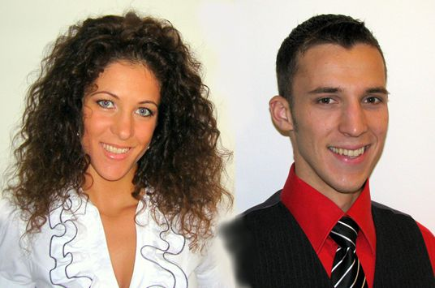

Der TSC hat ein neues Turnierpaar. Diána und Zoltán Varga fanden Anfang des Jahres den Weg zum TSC. Getanzt hatten die beiden schon in ihrer Heimat Ungarn. Seit April haben sie jetzt ein deutsches Startbuch. Sie tanzen in der Hauptgruppe C-Latein, und das mit viel Erfolg. Ihr erstes Turnier für den TSC tanzten sie am 20.5. in Ludwigsburg und belegten den zweiten Platz von insgesamt 18 Paaren. Bei ihrem zweiten Turnier in Augsburg am 8.6. waren 16 Paare am Start. Auch hier erreichten die beiden das Finale und brachten wieder den zweiten Platz mit nach Hause.

