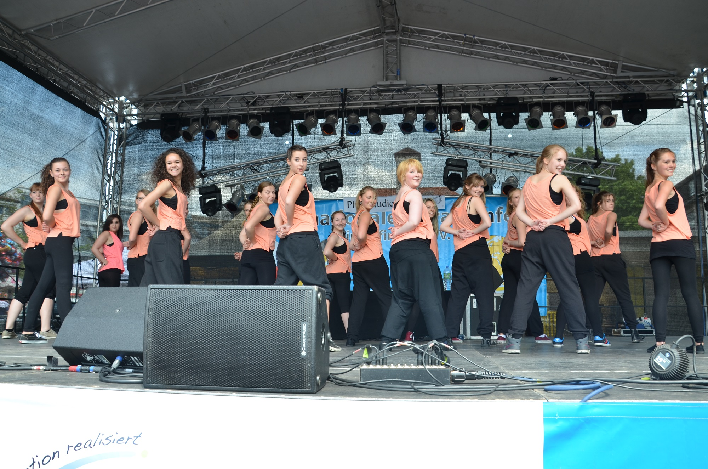

Die Jazztänzer des TSC im VfL Sindelfingen sind jetzt schon seit einigen Jahren ein fester Bestandteil des internationalen Straßenfests in Sindelfingen.  
 Mit mehr als 150 Tänzerinnen und Tänzern der Sparte Jazzdance-Style war der Tanzsportclub auch dieses Jahr an zwei Tagen dabei.   
Die 16 Jazzdance-Style Gruppen zogen - nicht nur aufgrung der fetzigen Musik - viele Zuschauer an.  
Gekonnt und ausdrucksstark wie immer brachten die Kinder-, Jugend- und Erwachsenengruppen ihre Tänze auf die Bühne.

Weitere Bilder finden Sie hier: [http://www.facebook.com/tsc.sindelfingen](http://www.facebook.com/tsc.sindelfingen)

