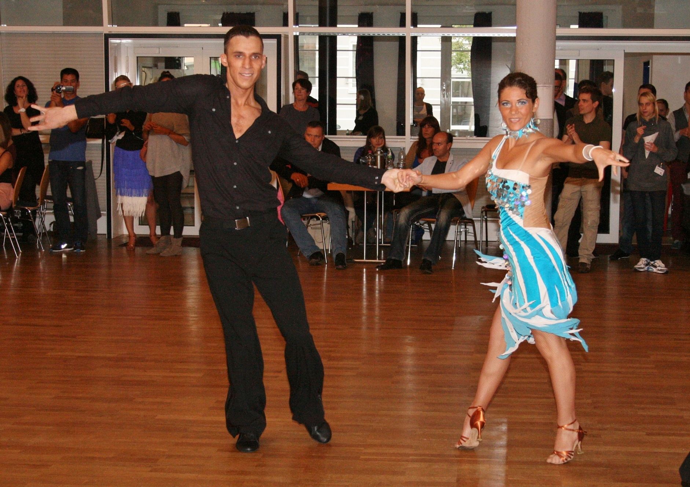

Zu Beginn dieses Jahres kamen Diána und Zoltán Varga zum TSC im VfL Sindelfingen. Getanzt hatten die beiden auch schon in ihrer Heimat Ungarn. Im Mai starteten sie zum ersten Mal in Deutschland und belegten auf Anhieb den zweiten Platz in ihrer Startklasse C I-Latein. Auch bei ihren nächsten Starts standen sie immer auf dem Treppchen. Zusammen mit dem Clubtrainer Rolandas Trembo hatte der TSC im Januar 2013 mit einem neuen Trainingskonzept für die Turnierpaare in Latein und Standard begonnen. Diána und Zoltán sind der beste Beweis, dass ein guter Weg eingeschlagen worden ist. Am 15. September tanzten die beiden dann in Karlsruhe ihre erste Landesmeisterschaft für den TSC. Durch das Training bei Rolandas Trembo und durch die Erfolge im Vorfeld der Landesmeisterschaft gut vorbereitet und hochmotiviert gingen sie auf das Parkett. Durch Musikalität, Rhythmusgefühl und die ausgesprochen gute Paarwirkung überzeugten sie die sieben Wertungsrichter. Ganz sicher erreichten Diána und Zoltán das mit sechs Paaren besetzte Finale. Diese sechs Paare tanzten alle auf einem sehr hohen Niveau, so dass sich keines von Anfang an als Favorit in den Vordergrund stellen konnte. Jedes Paar hätte bei dieser Konstellation den ersten Platz erreichen können. Das spiegelte sich auch in den Wertung wieder, die bei jedem Paar Wertungen vom ersten bis sechsten Platz enthielt. Das Ergebnis war am Ende denkbar knapp. Diána und Zoltán verpassten mit Platz vier ganz knapp das Siegerpodest. Besonders erfreulich war aber, dass sie bei ihrem insgesamt 7. Start in der C-Klasse mit dem Erreichen des Finales der Meisterschaft in die nächsthöhere B-Klasse aufgestiegen sind.

