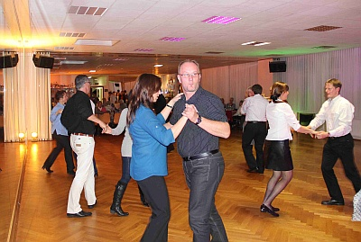

Gelungenes Herbstfest im TSC-Vereinsheim  
  
Das Herbstfest des TSC im VfL Sindelfingen war ein voller Erfolg. Im festlich hergerichteten Vereinsheim konnte die Abteilungsleiterin Dr. Anja Westerhoff über hundert Mitglieder und Freunde des Tanzsportclubs begrüßen.

Durch das Programm führten die Organisatoren Monika und Gerhard Winkler. Das Rahmenprogramm wurde von einer unserer Jazzdance-Style Kindergruppen eröffnet. Damit war gleich für gute Stimmung gesorgt.

Nach einigen Tänzen zu den Klängen der Band Filder-Express wurde das reichhaltige kalt-warme Büfett eröffnet. Die von einem Caterer gelieferten warmen Gerichte wurde durch von den Mitgliedern zubereiteten Salaten, Schnittchen, Nachspeisen und vielem mehr ergänzt. Nach dem Essen konnten erst einmal alle das Tanzbein schwingen.

Danach zeigten zwei Paare des TSC ihr Können. Die Standardtänze wurden von Carolin Bieber und Christian Wolf dargeboten. Diána Varga und Zoltán Varga waren für die Lateintänze zuständig. Nach einigen Tanzrunden für das Publikum zeigte die Jazzdance-Style Contest-Gruppe ihr Können und der Auftritt des S-Klasse Paars Diana Mongellaz und Steffan Isenecker rundete das gelungene Rahmenprogramm ab.

Die Tanz- und Showband Filder-Express animierte die Mitglieder und Gäste mit toller Tanzmusik und sorgte bis Mitternacht für eine volle Tanzfläche.

