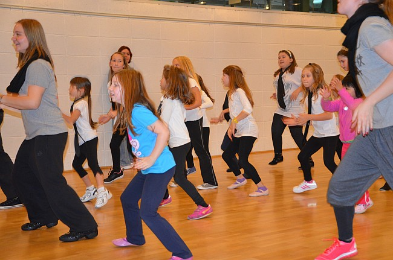

Am Sonntag, den 20.10.2013, lud der VfL Sindelfingen zum Familiensportfest in den Sindelfinger Glaspalast ein.

Von 11-17 Uhr boten verschiedene Abteilungen Stationen und Mitmachangebote an, bei denen die Kinder auf Teilnahmekarten Stempel sammeln und an einem Gewinnspiel teilnehmen konnten.

Auch der Tanzsportclub war hier vertreten und unterhielt die Kinder mit Limbo und einem Mitmachtanz, bei dem die Kinder schon einmal das Tanzbein schwingen und anschließend bei einem gemeinsamen Auftritt selbst ein wenig Bühnenluft schnuppern konnten.

Neben dem Mitmachtanz zeigten verschiedene Kinder- und Jugendgruppen sowie die Contestgruppe den Besuchern mit einstudierten Choreographien, wie toll Jazzdance-Style mit viel Training aussehen kann.

