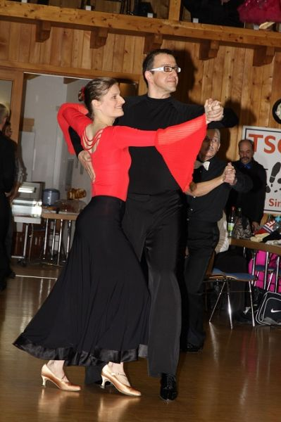

Bei den Sinsheimer Tanzsporttagen am 11.01.2014 tanzten Frank und Anja Westerhoff in den Startklassen Senioren I D-Standard und Senioren II D-Standard ihr allererstes Turnier. Nachdem noch vor 3 Jahren das erste Breitensportturnier nicht ganz zufriedenstellend verlief, war die Frage natürlich, wie sie nun in der „echten“ Turnierklasse abschneiden. Zum Turnierluft schnuppern stellten sie sich um 13 Uhr den jüngeren Konkurrenten der Senioren I D-Standard. 15 Paare gingen an den Start. Schnell war klar, dass sie sich fürs Semifinale qualifizieren würden. Als dann der Aufruf zum Finale kam, war die Freude groß. Das erste Ziel mit Platz 7 von 15 Paaren war erreicht.

Nach einer 1-stündigen Verschnaufpause ging es in die 2. Runde, die Senioren II D-Standard. Hier war das Feld mit 27 Paaren riesig, und wer ins Finale wollte, musste 4 Runden überstehen. Frank und Anja zeigten mit äußerst sauberer Technik, viel Freude am Tanzen und mit der Unterstützung des angereisten VFL Fanblocks, dass sie dieses Ziel erreichen wollen. Als dann wirklich wieder der Aufruf zum Finale kam war von Frank zu hören „das hätten wir nie erwartet“. Nach einem langen Turniertag mit insgesamt 7 Runden Tanzen ertanzten sie sich verdient und überglücklich einen 6. Platz von 27 Paaren.

Für Frank und Anja zeigte sich, dass das Standardtraining bei Rolandas Trembo der richtige Weg ist und in Sinsheim die ersten Früchte geerntet werden konnten.

`Bericht und Foto: Stefan Isenecker`

