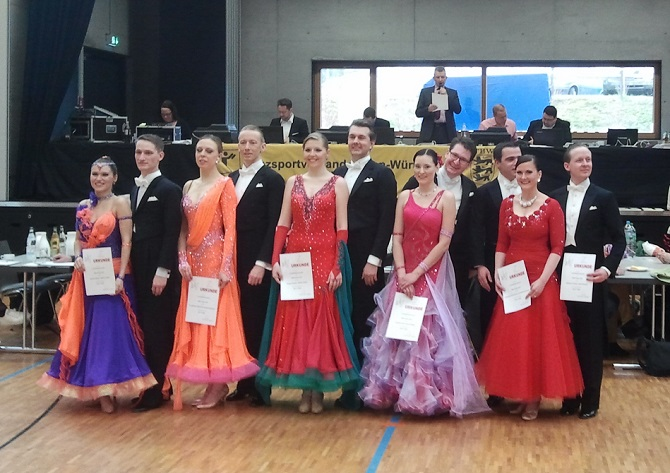

Am letzten Wochenende tanzten zwei Paare ihre jeweils ersten Turniere für den TSC im VfL Sindelfingen. In Höfingen zeigten bei der TBW-Trophy Carolin Bieber und Christian Wolf in der Startklasse Senioren II-B Standard ihr Können. Durch schönes und ausgeglichenes Tanzen kamen die Beiden ganz sicher ins Semifinale. Die Freude war groß, als sie auch fürs Finale aufgerufen wurden. Carolin und Christian erreichten schließlich den vierten Platz.

Das zweite neue Paar, Diane Mongellaz und Stefan Isenecker, ging in Karlsfeld in Bayern an den Start. Das Turnier der Startklasse Senioren II-S Standard war hochklassig besetzt. Diane und Stefan überzeugten durch gute Leistung und erreichten ebenfalls die Endrunde. Die Wertungen lagen sehr dicht beieinander. Am Ende verpassten die Beiden ganz knapp den dritten Platz und wurden Vierte.

