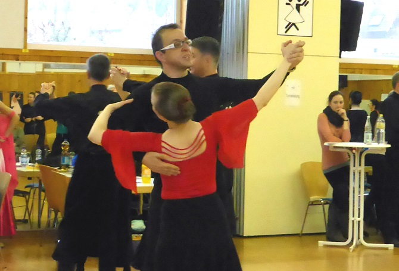

Anja und Frank Westerhoff können erneut auf ein erfolgreiches Turnierwochenende zurück blicken. Sie gingen an beiden Tagen an den Start. Am Samstag, 18.1. ging es nach Achern. Hier waren sie in den Startklasse Senioren I- und II-D Standard am Start. Bei den jüngeren Senioren verpassten sie mit dem 7. Platz knapp die Endrunde, aber in der Startklasse Senioren II-D lief es dann richtig gut. Mit ihrem technisch sauberen und schwungvollen Tanzen erreichten Anja und Frank sicher das Finale. Sie konnten hier sogar einige Paare hinter sich lassen, die in I-D Standard noch vor ihnen gelegen hatten. Für ihre gute Leistung wurden sie mit dem zweiten Platz belohnt. Am Sonntag ging es ins Kurhaus nach Baden-Baden zu einem Turnier der Senioren II-D Standard. Auch hier tanzten die Beiden in die Endrunde und konnten mit einem dritten Platz das Wochenende beschließen.

