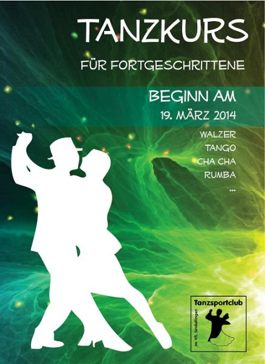

Ab dem 19. März beginnt der Tanzkurs für Fortgeschrittene! Auf Sie warten Walzer, Rumba, Cha Cha, Tango, ... von Standart über Latein ist für jeden etwas dabei!  
 Immer mittwochs von 20.30-22.00 Uhr wird in der Alten Aok in der Hanns-Martin-Schleyer-Straße 15 in Sindelfingen das Tanzbein geschwungen.  
 Die Kursdauer beträgt 10 Male und kostet 75€ pro Paar. Einen Preisvorteil gibt es für Paare, deren Kinder bereits TSC-Mitglied sind: Nur 70€!  
 Wenn Sie Lust haben oder einfach mal vorbeischauen wollen, schreiben Sie eine Mail an: kontakt@tanzsportclub.vfl-sindelfingen.de  
 Wir freuen uns auf Sie!

