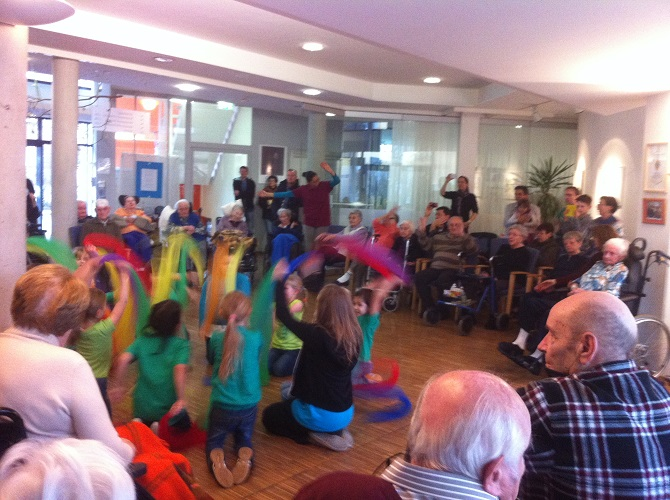

Am Sonntag, den 02.02.2014, besuchten zwei unserer Jazztanzgruppen das Haus Augustinus in Sindelfingen und sorgten  für Begeisterung und viele freudige Gesichter.

Sowohl eine Kinder- als auch eine Erwachsenentanzgruppe gestalteten mit den Bewohnern einen bunt gemischten musikalischen und tänzerischen Nachmittag unter der Leitung der beiden Trainerinnen Olivia Possart und Britta Sigmund. Es wurde gemeinsam getanzt, gespielt und gelacht.

