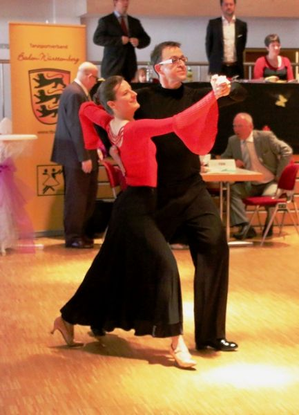

Am 8. März machten sich Anja und Frank Westerhoff auf den Weg nach Weinstadt-Endersbach zu ihrer allerersten Landesmeisterschaft der Startklasse Senioren II-D Standard. Auf dieses Turnier – ihr insgesamt erst sechstes – hatten die Beiden sich gut vorbereitet. Im Feld der 15 gestarteten Paare machten sie von Anfang an es gutes Bild. Über Vorrunde, Semifinale und bis ins Finale zeigten Anja und Frank musikalisches und technisch sauberes Tanzen. Im Finale bewerteten die sieben Wertungsrichter die Leistungen der sechs Paare sehr unterschiedlich, so dass es zu einem ganz engen Ergebnis kam. Bis zum letzten Tanz war nicht eindeutig zu erkennen, welches Paar die Plätze drei bis fünf belegen würde. Anja und Frank lagen am Ende mit gleicher Punktzahl auf einem geteilten vierten Platz. Da bei einer Landesmeisterschaft am Ende jedes Paar einem Platz zugeordnet werden muss, musste das Ergebnis weiter heruntergebrochen werden. Eine Platzziffer machte letztendlich den Unterschied und Anja und Frank wurden Fünfte. Anzumerken ist noch, dass das Paar auf dem dritten Platz nur einen einzigen Punkt vor dem eigentlich geteilten vierten und fünften Platz lag. Anja und Frank Westerhoff konnten aber auf jeden Fall mit ihrer Leistung und dem Erreichen der Endrunde zufrieden sein.

