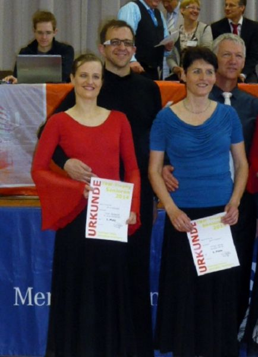

Anja und Frank Westerhoff haben den Aufstieg in die Startklasse Senioren C Standard geschafft. Und das innerhalb nur eines halben Jahres. In dieser Zeit tanzten die beiden insgesamt zehn Turniere der Startklassen Senioren I- und II-D. Bei neun dieser zehn Turniere erreichten sie die Endrunden und belegten somit immer vordere Plätze.  Ihre letzten vier Turniere tanzten Anja und Frank Westerhoff am letzten Wochenende im Rahmen der TBW-Trophy in Tübingen. Am ersten Tag belegten Sie sowohl in der Startklasse Senioren I-D als auch in II-D ganz souverän jeweils den ersten Platz. Der zweite Tag begann in der Senioren I-D Klasse mit einer kleinen Enttäuschung, denn sie erreichten im Finale „nur“ den vierten Platz. Das zweite Turnier in Senioren II-D lief dann wieder absolut rund. Schon mit dem Erreichen des Semifinales stand fest, dass Anja und Frank den Aufstieg in die C-Klasse in der Tasche hatten. Die Belohnung für die guten Leistungen war dann auch wieder der erste Platz.

