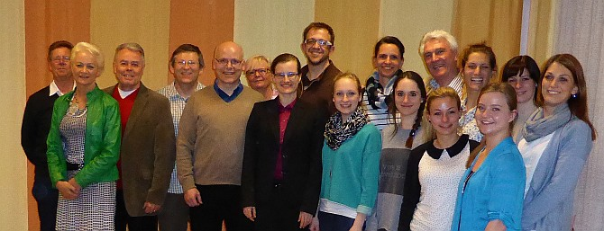
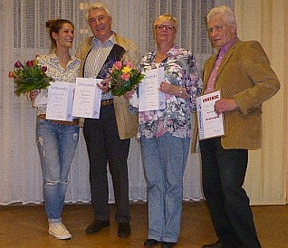

Beim TSC im VfL Sindelfingen waren die Mitglieder aufgerufen an der Jugend- und später an der Mitgliederversammlung teilzunehmen. Beide Versammlungen gingen problemlos über die Bühne.   
  
Die Berichte aus den einzelnen Bereichen der Tanzsportabteilung konnten eigentlich nur Positives beinhalten. Die Vertreterin des Hauptvereins, Frau Annette Bronder, fand eine geordnete und finanziell gut gestellte Abteilung vor. Dies wurde auch von den beiden Kassenprüfern bestätigt. Mit gutem Gewissen konnte sie die Entlastung der Abteilungsleitung vornehmen.   
  
Ein wichtiger Tagesordnungspunkt waren anschließend die turnusmäßigen Neuwahlen der gesamten Abteilungsleitung. Hier gab es im Wesentlichen keine Änderungen. Einige Mitarbeiter der Abteilungsleitung standen nicht mehr zur Wahl. Alle offenen Positionen konnten aber wieder besetzt werden.   
Dr. Anja Westerhoff wird auch in den beiden folgenden Jahren die Geschicke der Tanzsportabteilung leiten.   
Sie gab auch gleich einen Ausblick auf die Zukunft. So konnte sie vermelden, dass der TSC wieder einige erfolgreiche Turnierpaare hat. Dies ist sicher auch auf das gute Training von Clubtrainer Rolandas Trembo zurückzuführen, der sowohl den Latein- als auch den Standardbereich abdeckt.   
  
Gezielte Werbung hat außerdem dazu geführt, dass statt der bisher nur wenigen Kinder mittlerweile mehr als 40 beim TSC trainieren und an den Turniersport herangeführt werden.   
  
Aus dem Jazzbereich ist zu berichten, dass hier immer noch tolle Arbeit geleistet und viel auf die Beine gestellt wird. Unter anderem laufen schon jetzt die ersten Vorbereitungen auf die große Tanzshow im Februar 2015.   
  
Im letzten Jahr hat der TSC mit einer Kooperation mit einem Sindelfinger Altenheim begonnen. Hier gibt es Tanzvorführungen, aber auch gemeinsames Tanzen und es wird auch gesungen und miteinander geredet. Da sowohl die Heimbewohner als auch die Tänzer viel Freude bei den zusammen verbrachten Nachmittagen hatten, sind für das Jahr 2014 bereits wieder vier Termine vereinbart.  
  
Ein weiterer Tagesordnungspunkt war die Ehrung einiger Mitglieder für ihren langen und erfolgreichen Einsatz für Tanzsportabteilung. Frau Annette Bronder überreichte gleich drei Verdienstnadeln des VfL. Maren Reichel erhielt eine in Bronze, Christine Richter und Klaus Arndt bekamen die Silberne. Aber die Abteilung selbst hatte noch eine besondere Ehrung vorzunehmen. In seiner Laudation ging der Ehrenvorsitzende Dieter Kühneweg auf den jahrzehntlangen Einsatz von Rolf Zimmer für den TSC ein. Rolf Zimmer war insgesamt 21 Jahre lang Sportwart der Abteilung und damit für den gesamten Sportbetrieb zuständig. Und noch heute kümmert er sich um die Räumlichkeiten des TSC, damit alle anderen immer die idealen Bedingungen für ihr Training vorfinden. Als Dank wurde er jetzt zum Ehrenmitglied ernannt.

