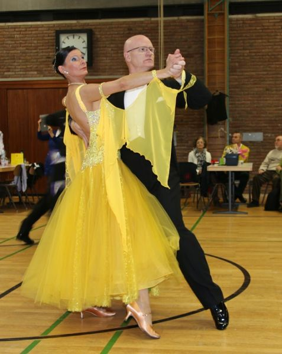

Mehr als 60 Paare zog es zum Ranglistenturnier der Senioren II-S Standard nach Friedrichshafen, das im Rahmen des 33. Internationalen Bodenseetanzfestes ausgetragen wurde. Mit dabei waren auch Diane Mongellaz und Stefan Isenecker vom TSC im VfL Sindelfingen. Messen mussten sie sich mit den Spitzenpaaren aus ganz Deutschland. Das gelang ihnen ausgesprochen gut. Sie tanzten drei der fünf Wertungsrunden und waren mit ihrem Platz im vorderen Mittelfeld mehr als zufrieden. Anja und Frank Westerhoff tanzten in Konstanz, einem weiteren Austragungsort des Tanzfestes, ihr erstes Turnier in der Startklasse Senioren II-C Standard. Ohne Probleme erreichten sie das Finale und mit Platz zwei auch gleich einen Platz auf dem Siegertreppchen.

