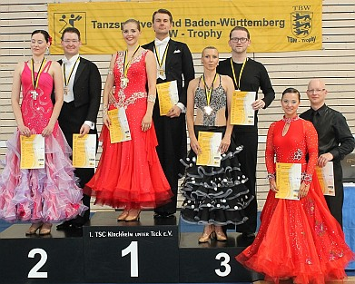

### 

Mit dem dritten Qualifikationswochenende und den Siegerehrungen der TBW-Trophy-Rangliste ging am Sonntag, 21. Juni, die 12. Ausgabe der TBW-Trophy der Hauptgruppen in Kirchheim unter Teck im Rahmen der Tübinger Tanzsporttage zu Ende. Vom TSC im VfL Sindelfingen mit dabei waren Carolin Bieber und Christian Wolf. Und das mit Erfolg: sowohl am Samstag als auch am Sonntag erreichten sie die Endrunden. Damit hatten sie in der Gesamtabrechnung der sechs Trophy-Turniere ihrer Startklasse Hauptgruppe II-B Standard für dieses Jahr den zweiten Platz erreicht. Belohnt wurden sie dafür mit der silbernen Medaille der TBW-Trophy.

