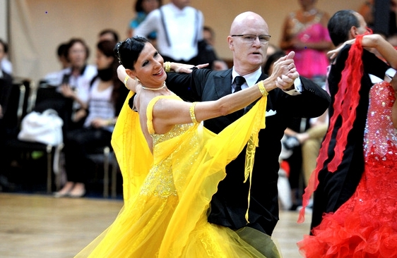

## 

Zwei Paare des TSC im VfL Sindelfingen gingen bei den German Open Championships an den Start. Die Senioren-II S Klasse war mit 297 Paaren aus 21 Nationen hochkarätig besetzt. Für ein noch höheres Leistungsniveau als in den Vorjahren sorgte auch die um 5 Jahre reduzierte Altersgrenze. Viele junge Paare der Senioren-I Klasse nutzten die Gelegenheit in die Senioren-II Klasse zu wechseln.

Sylvia und Lutz Benedix hatten sich das weltgrößte Tanzturnier für ihren ersten Start für den TSC im VfL Sindelfingen in der Startklasse Senioren II-S Standard ausgesucht. Nach einer langen Verletzungspause gingen sie erstmals an den Start und zeigten in dem hochklassigen Feld eine gute Leistung und konnten etliche Paare hinter sich lassen.

Auch Diane Mongellaz und Stefan Isenecker zeigten ihr Können in dieser Startklasse. Sicher qualifizierten sie sich für die zweite Runde mit immer noch 174 Paaren. Groß war die Freude als klar war, dass die beiden auch die dritte Runde erreicht hatten. Hier mussten sie sich mit 95 Paaren auseinandersetzen. Diane und Stefan konnten sich gegenüber den vorhergehenden Runden noch einmal steigern. Mit dem Erreichen von Platz 77 von 297 Paare waren sie hoch zufrieden.

