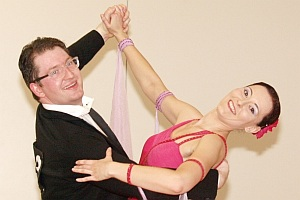

 Carolin Bieber und Christian Wolf tanzten am vergangenen Wochenende eine sehr erfolgreiche Landesmeisterschaft in der Hauptgruppe II-B Standard. Nachdem sie bei den Turnieren in den letzten Wochen immer das Finale erreichen konnten, gingen die beiden optimistisch zur TBW-Landesmeisterschaft in Feuerbach. Ihr Optimismus sollte sich bestätigen, denn durch ihr musikalisches und ausdrucksstarkes Tanzen belegten sie am Ende ganz klar den zweiten Platz und wurden dafür mit der Silbermedaille belohnt.

## 

## 

## 

Ebenfalls am letzten Wochenende unterwegs waren Diane Mongellaz und Stefan Isenecker. Sie nahmen in Nürnberg am Ranglistenturnier in der Startklasse Senioren II-S Standard teil. Am Start waren alle deutschen Spitzenpaare dieser Startklasse. Ein respektabler 29. Platz in diesem starken Teilnehmerfeld von 77 Paaren konnte sich sehen lassen.

