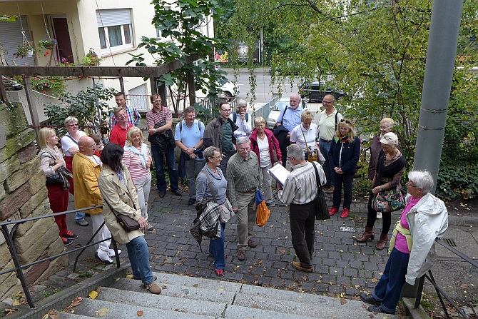

Die Tänzer des TSC im VfL Sindelfingen bewiesen wieder einmal, dass es nicht nur Tanzen für sie gibt. Monika und Gerhard Winkler hatten einen Stadtspaziergang in Stuttgart der etwas anderen Art geplant. Am 21. September ging es los. Treffpunkt war der Schlossplatz in Stuttgarts Mitte. Unsere Stadtführer Monika und Gerhard Winkler hatten sich perfekt vorbereitet und übernahmen die Führung der Gruppe.

Zuerst führte Monika uns zu einem minimalistischen Kunstwerk, von dem bisher noch niemand etwas gehört hatte und das auch keiner auf den ersten Blick als solches erkennen konnte. Micha Ullmanns Abendstern ist nämlich fast nichts. Lediglich eine halbkugelförmige Vertiefung mit knapp vier Zentimeter Durchmesser in einer Gehwegplatte an der Straßenecke Bolz- und Stauffenbergstraße.

Weiter ging es vorbei am Marquartbau zu den wenigen verbliebenen Resten des ersten Central Bahnhofs von Stuttgart in der Bolzstraße. Es handelte sich dabei um einen viergleisigen Kopfbahnhof mit einer hölzernen Dachkonstruktion. Gerhards Erklärungen und alte Fotos erleichterte allen, sich das alte Gebäude vorzustellen. Von den damals ins Stadtbild passenden Rundportalen sind heute noch einige erhalten. Dann wurde es anstrengend. Über viele Stufen kletterten die Tänzer hinauf zur Panoramastraße im Stuttgarter Westen. Oben angekommen führte der Weg vorbei an den großen Stadtvillen zum Chinesischen Garten. Dieser kleine Garten ist eine Welt im kleinen Maßstab, ein Mikrokosmos mit den Elementen der Schöpfung: Steinschichtungen stellen Gebirge dar, Teiche entsprechen den Meeren, Gartenpflanzen die natürliche Vegetation. Hier warteten Monika und Gerhard mit einer Überraschung auf und servierten den Spaziergängern Sekt und etwas zum Knabbern. Danach ging es langsam wieder bergab über den Hoppenlauweg zur Russischen Kirche, die leider an diesem Tag nicht von Innen besichtigt werden konnte. Nachdem die Gruppe den Hoppenlaufriedhof überquert hatte führte der Weg vorbei an der Hospitalkirche zum Rotebühlplatz und weiter zu einem netten Lokal. Hier fand der, dank Monikas und Gerhards Erklärungen, interessante und kurzweilige Tag bei einem guten Essen seinen Abschluss.

